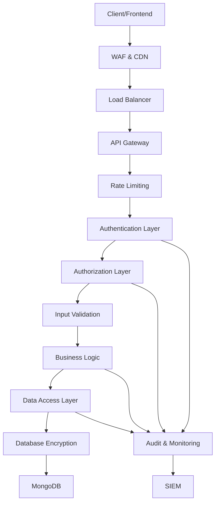

# Architecture Sécurité - O'Ypunu Backend

## 🔐 Vue d'Ensemble de la Sécurité

La plateforme O'Ypunu implémente une architecture de sécurité multicouche pour protéger les données des utilisateurs, garantir l'intégrité du contenu et prévenir les attaques malveillantes. Cette approche combine des mesures préventives, détectives et correctives.

## 🛡️ Modèle de Sécurité Multicouche



## 🔑 Authentification et Autorisation

### 1. Système d'Authentification JWT

#### Configuration JWT
```typescript
const jwtConfig = {
  // Token d'accès (courte durée)
  accessToken: {
    secret: process.env.JWT_SECRET,
    expiresIn: '15m',           // 15 minutes
    algorithm: 'HS256',
    issuer: 'oypunu-api',
    audience: 'oypunu-client'
  },
  
  // Token de rafraîchissement (longue durée)
  refreshToken: {
    secret: process.env.JWT_REFRESH_SECRET,
    expiresIn: '7d',            // 7 jours
    algorithm: 'HS256',
    issuer: 'oypunu-api',
    audience: 'oypunu-client'
  }
};

// Rotation automatique des refresh tokens
const tokenRotationConfig = {
  rotateOnRefresh: true,        // Nouveau refresh token à chaque utilisation
  reuseWindow: 300,            // 5 minutes de fenêtre de réutilisation
  maxReuses: 3,                // Maximum 3 réutilisations
  blacklistOnBreach: true      // Blacklist en cas de détection d'abus
};
```

#### Implémentation Sécurisée
```typescript
@Injectable()
export class SecureAuthService {
  // Génération de tokens avec métadonnées de sécurité
  async generateTokens(user: User, metadata: TokenMetadata): Promise<AuthTokens> {
    const payload = {
      sub: user._id.toString(),
      email: user.email,
      role: user.role,
      iat: Math.floor(Date.now() / 1000),
      
      // Métadonnées de sécurité
      device: this.generateDeviceFingerprint(metadata),
      location: await this.getLocationFromIP(metadata.ipAddress),
      sessionId: uuidv4()
    };

    const accessToken = jwt.sign(payload, jwtConfig.accessToken.secret, {
      expiresIn: jwtConfig.accessToken.expiresIn,
      algorithm: jwtConfig.accessToken.algorithm,
      issuer: jwtConfig.accessToken.issuer,
      audience: jwtConfig.accessToken.audience
    });

    const refreshToken = await this.createRefreshToken(user._id, metadata);
    
    // Audit de connexion
    await this.auditService.logAuthEvent('login_success', user._id, metadata);
    
    return { accessToken, refreshToken };
  }

  // Validation avancée des tokens
  async validateToken(token: string, metadata: TokenMetadata): Promise<TokenValidationResult> {
    try {
      const decoded = jwt.verify(token, jwtConfig.accessToken.secret) as JwtPayload;
      
      // Vérifications de sécurité supplémentaires
      const validations = await Promise.all([
        this.validateDeviceFingerprint(decoded.device, metadata),
        this.validateLocationConsistency(decoded.location, metadata.ipAddress),
        this.checkTokenBlacklist(decoded.jti),
        this.validateSessionIntegrity(decoded.sessionId, decoded.sub)
      ]);
      
      if (validations.some(v => !v.valid)) {
        await this.auditService.logSecurityEvent('token_validation_failed', decoded.sub, {
          reason: validations.filter(v => !v.valid).map(v => v.reason),
          metadata
        });
        
        return { valid: false, reason: 'Security validation failed' };
      }
      
      return { valid: true, payload: decoded };
      
    } catch (error) {
      await this.auditService.logSecurityEvent('token_invalid', null, { error: error.message, metadata });
      return { valid: false, reason: error.message };
    }
  }
}
```

### 2. Système de Rôles et Permissions

#### Hiérarchie des Rôles
```typescript
enum UserRole {
  USER = 'user',                    // Utilisateur standard
  CONTRIBUTOR = 'contributor',       // Peut créer des mots
  ADMIN = 'admin',                  // Administration générale
  SUPERADMIN = 'superadmin'         // Administration complète
}

// Matrice des permissions
const rolePermissions = {
  [UserRole.USER]: [
    'words:read',
    'words:search',
    'words:favorite',
    'profile:read',
    'profile:update',
    'communities:join'
  ],
  
  [UserRole.CONTRIBUTOR]: [
    ...rolePermissions[UserRole.USER],
    'words:create',
    'words:update:own',
    'words:audio:upload',
    'communities:create',
    'communities:post'
  ],
  
  [UserRole.ADMIN]: [
    ...rolePermissions[UserRole.CONTRIBUTOR],
    'words:moderate',
    'words:approve',
    'words:reject',
    'users:view',
    'communities:moderate',
    'analytics:view'
  ],
  
  [UserRole.SUPERADMIN]: [
    ...rolePermissions[UserRole.ADMIN],
    'users:manage',
    'users:roles:update',
    'system:configure',
    'audit:view',
    'database:manage'
  ]
};
```

#### Implémentation RBAC (Role-Based Access Control)
```typescript
@Injectable()
export class AuthorizationService {
  async checkPermission(user: User, resource: string, action: string): Promise<boolean> {
    // Vérifier si l'utilisateur est actif
    if (!user.isActive) {
      await this.auditService.logSecurityEvent('access_denied_inactive_user', user._id);
      return false;
    }
    
    // Construction de la permission
    const permission = `${resource}:${action}`;
    const userPermissions = rolePermissions[user.role] || [];
    
    // Vérification directe
    if (userPermissions.includes(permission)) {
      return true;
    }
    
    // Vérification des permissions spéciales (propriétaire de ressource)
    if (action === 'update:own' || action === 'delete:own') {
      const isOwner = await this.checkResourceOwnership(user._id, resource, action);
      if (isOwner) {
        await this.auditService.logAuthEvent('resource_access_owner', user._id, { resource, action });
        return true;
      }
    }
    
    // Log de tentative d'accès non autorisé
    await this.auditService.logSecurityEvent('unauthorized_access_attempt', user._id, {
      resource,
      action,
      userRole: user.role,
      requiredPermission: permission
    });
    
    return false;
  }

  // Vérification contextuelle des permissions
  async checkContextualPermission(
    user: User, 
    resource: string, 
    action: string, 
    context: any
  ): Promise<boolean> {
    const hasBasicPermission = await this.checkPermission(user, resource, action);
    
    if (!hasBasicPermission) {
      return false;
    }
    
    // Vérifications contextuelles spécifiques
    switch (resource) {
      case 'community':
        return await this.checkCommunityPermission(user, action, context.communityId);
      
      case 'message':
        return await this.checkMessagePermission(user, action, context.conversationId);
      
      case 'word':
        return await this.checkWordPermission(user, action, context.wordId);
      
      default:
        return true;
    }
  }
}
```

## 🔒 Sécurité des Données

### 1. Chiffrement des Données

#### Chiffrement au Repos
```typescript
// Configuration MongoDB avec chiffrement
const mongoEncryptionConfig = {
  // Chiffrement transparent au niveau base
  encryptionAtRest: {
    enabled: true,
    keyManagement: 'aws-kms',
    keyId: process.env.AWS_KMS_KEY_ID
  },
  
  // Chiffrement au niveau champ (données sensibles)
  fieldLevelEncryption: {
    keyVault: 'encryption.__keyVault',
    kmsProviders: {
      aws: {
        accessKeyId: process.env.AWS_ACCESS_KEY_ID,
        secretAccessKey: process.env.AWS_SECRET_ACCESS_KEY,
        region: process.env.AWS_REGION
      }
    },
    schemaMap: {
      'oypunu.users': {
        bsonType: 'object',
        encryptMetadata: {
          keyId: [Binary.createFromBase64(process.env.USER_ENCRYPTION_KEY)]
        },
        properties: {
          // Chiffrer les données PII
          email: {
            encrypt: {
              bsonType: 'string',
              algorithm: 'AEAD_AES_256_CBC_HMAC_SHA_512-Random'
            }
          },
          personalInfo: {
            encrypt: {
              bsonType: 'object',
              algorithm: 'AEAD_AES_256_CBC_HMAC_SHA_512-Deterministic'
            }
          }
        }
      }
    }
  }
};
```

#### Chiffrement en Transit
```typescript
// Configuration HTTPS/TLS
const tlsConfig = {
  // TLS 1.3 minimum
  minVersion: 'TLSv1.3',
  
  // Ciphers sécurisés uniquement
  ciphers: [
    'ECDHE-RSA-AES256-GCM-SHA384',
    'ECDHE-RSA-AES128-GCM-SHA256',
    'ECDHE-RSA-AES256-SHA384',
    'ECDHE-RSA-AES128-SHA256'
  ].join(':'),
  
  // Configuration SSL/TLS stricte
  honorCipherOrder: true,
  secureProtocol: 'TLSv1_3_method',
  
  // Certificats
  cert: fs.readFileSync(process.env.SSL_CERT_PATH),
  key: fs.readFileSync(process.env.SSL_KEY_PATH),
  ca: fs.readFileSync(process.env.SSL_CA_PATH)
};

// Middleware HSTS et sécurité headers
const securityHeaders = {
  'Strict-Transport-Security': 'max-age=31536000; includeSubDomains; preload',
  'X-Content-Type-Options': 'nosniff',
  'X-Frame-Options': 'DENY',
  'X-XSS-Protection': '1; mode=block',
  'Referrer-Policy': 'strict-origin-when-cross-origin',
  'Content-Security-Policy': "default-src 'self'; script-src 'self' 'unsafe-inline'; style-src 'self' 'unsafe-inline'",
  'Permissions-Policy': 'camera=(), microphone=(), geolocation=()'
};
```

### 2. Gestion des Secrets et Clés

#### Rotation Automatique des Secrets
```typescript
@Injectable()
export class SecretRotationService {
  private rotationSchedule = {
    jwtSecret: '30d',           // 30 jours
    refreshSecret: '90d',       // 90 jours
    encryptionKey: '180d',      // 180 jours
    apiKeys: '60d'              // 60 jours
  };

  async rotateJWTSecrets(): Promise<void> {
    const newSecret = this.generateSecureSecret(64);
    const newRefreshSecret = this.generateSecureSecret(64);
    
    // Stocker dans AWS Secrets Manager
    await this.secretsManager.updateSecret('jwt-secret', newSecret);
    await this.secretsManager.updateSecret('jwt-refresh-secret', newRefreshSecret);
    
    // Période de grâce pour les anciens tokens
    await this.tokenService.scheduleGracefulRotation(newSecret, '1h');
    
    // Audit de rotation
    await this.auditService.logSecurityEvent('secret_rotation', null, {
      secretType: 'jwt',
      rotationId: uuidv4(),
      timestamp: new Date()
    });
  }

  private generateSecureSecret(length: number): string {
    return crypto.randomBytes(length).toString('base64url');
  }
}
```

## 🛡️ Protection contre les Attaques

### 1. Rate Limiting Avancé

```typescript
@Injectable()
export class AdvancedRateLimitingService {
  private limitConfigs = {
    // Authentification - très restrictif
    'auth:login': { points: 5, duration: 900 },       // 5 tentatives / 15 min
    'auth:register': { points: 3, duration: 3600 },   // 3 inscriptions / heure
    'auth:forgot-password': { points: 2, duration: 3600 },
    
    // API générale
    'api:general': { points: 1000, duration: 60 },    // 1000 req / minute
    'api:search': { points: 100, duration: 60 },      // 100 recherches / minute
    
    // Upload de fichiers
    'upload:audio': { points: 10, duration: 3600 },   // 10 uploads / heure
    'upload:image': { points: 20, duration: 3600 },   // 20 uploads / heure
    
    // Admin endpoints
    'admin:moderation': { points: 200, duration: 60 } // 200 actions / minute
  };

  async checkRateLimit(
    key: string, 
    identifier: string, 
    metadata: RequestMetadata
  ): Promise<RateLimitResult> {
    const config = this.limitConfigs[key];
    if (!config) {
      return { allowed: true };
    }

    // Clé composite pour rate limiting
    const compositeKey = `ratelimit:${key}:${identifier}`;
    
    // Vérifier limite standard
    const standardCheck = await this.redis.incr(compositeKey);
    if (standardCheck === 1) {
      await this.redis.expire(compositeKey, config.duration);
    }
    
    if (standardCheck > config.points) {
      // Log de détection de rate limiting
      await this.auditService.logSecurityEvent('rate_limit_exceeded', identifier, {
        key,
        attempts: standardCheck,
        limit: config.points,
        metadata
      });
      
      // Vérifier si pattern d'attaque
      const suspiciousActivity = await this.detectSuspiciousPattern(identifier, key);
      if (suspiciousActivity) {
        await this.escalateSecurityThreat(identifier, suspiciousActivity);
      }
      
      return { 
        allowed: false, 
        resetTime: await this.redis.ttl(compositeKey),
        remaining: 0
      };
    }
    
    return { 
      allowed: true, 
      remaining: config.points - standardCheck,
      resetTime: await this.redis.ttl(compositeKey)
    };
  }

  // Détection de patterns d'attaque
  private async detectSuspiciousPattern(identifier: string, key: string): Promise<boolean> {
    const recentAttempts = await this.redis.get(`suspicious:${identifier}`);
    const attemptCount = parseInt(recentAttempts) || 0;
    
    // Incrémenter tentatives suspectes
    await this.redis.setex(`suspicious:${identifier}`, 3600, attemptCount + 1);
    
    // Pattern d'attaque détecté si > 5 rate limits différents en 1h
    return attemptCount >= 5;
  }
}
```

### 2. Protection CSRF et XSS

```typescript
// Protection CSRF avec tokens dynamiques
@Injectable()
export class CSRFProtectionService {
  async generateCSRFToken(sessionId: string): Promise<string> {
    const token = crypto.randomBytes(32).toString('hex');
    await this.redis.setex(`csrf:${sessionId}`, 3600, token);
    return token;
  }

  async validateCSRFToken(sessionId: string, providedToken: string): Promise<boolean> {
    const storedToken = await this.redis.get(`csrf:${sessionId}`);
    
    if (!storedToken || !providedToken) {
      return false;
    }
    
    // Comparaison sécurisée pour éviter timing attacks
    return crypto.timingSafeEqual(
      Buffer.from(storedToken, 'hex'),
      Buffer.from(providedToken, 'hex')
    );
  }
}

// Sanitisation XSS
@Injectable()
export class XSSProtectionService {
  sanitizeInput(input: any): any {
    if (typeof input === 'string') {
      return DOMPurify.sanitize(input, {
        ALLOWED_TAGS: ['b', 'i', 'em', 'strong', 'p', 'br'],
        ALLOWED_ATTR: [],
        FORBID_SCRIPT: true,
        FORBID_TAGS: ['script', 'object', 'embed', 'form', 'input'],
        STRIP_COMMENTS: true
      });
    }
    
    if (Array.isArray(input)) {
      return input.map(item => this.sanitizeInput(item));
    }
    
    if (typeof input === 'object' && input !== null) {
      const sanitized = {};
      for (const [key, value] of Object.entries(input)) {
        sanitized[this.sanitizeString(key)] = this.sanitizeInput(value);
      }
      return sanitized;
    }
    
    return input;
  }
}
```

### 3. Protection contre l'Injection SQL/NoSQL

```typescript
// Validation et sanitisation MongoDB
@Injectable()
export class NoSQLInjectionProtection {
  sanitizeMongoQuery(query: any): any {
    if (typeof query !== 'object' || query === null) {
      return query;
    }
    
    // Supprimer les opérateurs dangereux
    const dangerousOperators = ['$where', '$eval', '$function', '$accumulator'];
    
    for (const op of dangerousOperators) {
      if (query[op]) {
        throw new SecurityException(`Dangerous operator detected: ${op}`);
      }
    }
    
    // Récursion pour nettoyer les sous-objets
    const sanitized = {};
    for (const [key, value] of Object.entries(query)) {
      if (key.startsWith('$') && !this.isAllowedOperator(key)) {
        throw new SecurityException(`Forbidden operator: ${key}`);
      }
      
      sanitized[key] = typeof value === 'object' 
        ? this.sanitizeMongoQuery(value)
        : value;
    }
    
    return sanitized;
  }

  private isAllowedOperator(operator: string): boolean {
    const allowedOperators = [
      '$eq', '$ne', '$gt', '$gte', '$lt', '$lte',
      '$in', '$nin', '$exists', '$type', '$regex',
      '$and', '$or', '$not', '$nor',
      '$all', '$elemMatch', '$size',
      '$text', '$search'
    ];
    
    return allowedOperators.includes(operator);
  }
}
```

## 🔍 Monitoring et Détection des Menaces

### 1. Système de Détection d'Intrusion (IDS)

```typescript
@Injectable()
export class IntrusionDetectionService {
  private suspiciousPatterns = [
    // Tentatives de brute force
    {
      name: 'brute_force_login',
      pattern: /^auth:login/,
      threshold: 10,
      timeWindow: 300,
      severity: 'high'
    },
    
    // Scan de ports/endpoints
    {
      name: 'endpoint_scanning',
      pattern: /404|403/,
      threshold: 50,
      timeWindow: 60,
      severity: 'medium'
    },
    
    // Tentatives d'injection
    {
      name: 'injection_attempt',
      pattern: /(SELECT|UNION|DROP|INSERT|UPDATE|DELETE|\$where|\$eval)/i,
      threshold: 5,
      timeWindow: 300,
      severity: 'critical'
    }
  ];

  async analyzeRequest(request: SecurityRequest): Promise<ThreatAnalysis> {
    const threats: DetectedThreat[] = [];
    
    // Analyser les patterns suspects
    for (const pattern of this.suspiciousPatterns) {
      const matches = await this.checkPattern(request, pattern);
      if (matches.detected) {
        threats.push({
          type: pattern.name,
          severity: pattern.severity,
          evidence: matches.evidence,
          confidence: matches.confidence
        });
      }
    }
    
    // Analyse comportementale
    const behaviorAnalysis = await this.analyzeBehavior(request);
    if (behaviorAnalysis.anomaly) {
      threats.push(behaviorAnalysis.threat);
    }
    
    // Calculer score de risque global
    const riskScore = this.calculateRiskScore(threats);
    
    return {
      riskScore,
      threats,
      recommended_action: this.getRecommendedAction(riskScore)
    };
  }

  private async analyzeBehavior(request: SecurityRequest): Promise<BehaviorAnalysis> {
    const userBehavior = await this.getUserBehaviorProfile(request.userId);
    
    // Vérifications comportementales
    const anomalies = [
      this.checkLocationAnomaly(request, userBehavior),
      this.checkTimeAnomaly(request, userBehavior),
      this.checkVolumeAnomaly(request, userBehavior),
      this.checkPatternAnomaly(request, userBehavior)
    ];
    
    const significantAnomalies = anomalies.filter(a => a.score > 0.7);
    
    return {
      anomaly: significantAnomalies.length > 0,
      threat: significantAnomalies.length > 0 ? {
        type: 'behavioral_anomaly',
        severity: 'medium',
        evidence: significantAnomalies,
        confidence: Math.max(...significantAnomalies.map(a => a.score))
      } : null
    };
  }
}
```

### 2. Audit Trail Complet

```typescript
// Schema d'audit sécurisé
interface SecurityAuditLog {
  _id: ObjectId;
  timestamp: Date;
  eventType: 'auth' | 'security' | 'access' | 'data' | 'admin';
  eventName: string;
  severity: 'low' | 'medium' | 'high' | 'critical';
  
  // Acteur
  userId?: ObjectId;
  userRole?: string;
  sessionId?: string;
  
  // Contexte
  resource?: string;
  action?: string;
  outcome: 'success' | 'failure' | 'blocked';
  
  // Métadonnées techniques
  ipAddress: string;
  userAgent: string;
  location?: {
    country: string;
    region: string;
    city: string;
  };
  
  // Détails de sécurité
  threatLevel?: number;
  evidence?: any;
  mitigationAction?: string;
  
  // Intégrité
  checksum: string;                    // Hash pour vérifier l'intégrité
  previousLogHash?: string;            // Chaînage pour détecter les modifications
}

@Injectable()
export class SecurityAuditService {
  async logSecurityEvent(
    eventName: string,
    userId: string | null,
    details: any,
    severity: 'low' | 'medium' | 'high' | 'critical' = 'medium'
  ): Promise<void> {
    const auditEntry: SecurityAuditLog = {
      _id: new ObjectId(),
      timestamp: new Date(),
      eventType: 'security',
      eventName,
      severity,
      userId: userId ? new ObjectId(userId) : null,
      outcome: details.outcome || 'success',
      ipAddress: details.ipAddress,
      userAgent: details.userAgent,
      evidence: details.evidence,
      checksum: '', // Calculé ci-dessous
      previousLogHash: await this.getLastLogHash()
    };
    
    // Calculer checksum pour intégrité
    auditEntry.checksum = this.calculateChecksum(auditEntry);
    
    // Sauvegarder avec protection contre l'altération
    await this.secureAuditRepository.create(auditEntry);
    
    // Alerte en temps réel pour événements critiques
    if (severity === 'critical') {
      await this.alertingService.sendSecurityAlert(auditEntry);
    }
  }

  private calculateChecksum(entry: SecurityAuditLog): string {
    const data = {
      timestamp: entry.timestamp.toISOString(),
      eventType: entry.eventType,
      eventName: entry.eventName,
      userId: entry.userId?.toString(),
      evidence: JSON.stringify(entry.evidence),
      previousLogHash: entry.previousLogHash
    };
    
    return crypto
      .createHash('sha256')
      .update(JSON.stringify(data))
      .digest('hex');
  }
}
```

## 🚨 Réponse aux Incidents

### 1. Playbook de Réponse Automatisée

```typescript
@Injectable()
export class IncidentResponseService {
  private responsePlaybooks = {
    'brute_force_attack': {
      immediate: ['block_ip', 'alert_admins'],
      investigation: ['analyze_logs', 'check_successful_logins'],
      containment: ['temp_account_lock', 'force_password_reset'],
      recovery: ['unlock_accounts', 'update_security_policies']
    },
    
    'data_breach_suspected': {
      immediate: ['isolate_system', 'alert_dpo', 'emergency_admin_meeting'],
      investigation: ['forensic_analysis', 'identify_scope'],
      containment: ['revoke_all_tokens', 'encrypted_backup'],
      recovery: ['user_notification', 'security_audit', 'compliance_report']
    },
    
    'privilege_escalation': {
      immediate: ['suspend_account', 'alert_security_team'],
      investigation: ['audit_role_changes', 'check_admin_actions'],
      containment: ['revoke_elevated_permissions', 'review_all_admin_accounts'],
      recovery: ['restore_proper_permissions', 'implement_additional_controls']
    }
  };

  async handleSecurityIncident(incident: SecurityIncident): Promise<IncidentResponse> {
    const playbook = this.responsePlaybooks[incident.type];
    
    if (!playbook) {
      await this.escalateToHuman(incident);
      return { status: 'escalated', actions: [] };
    }
    
    const response: IncidentResponse = {
      incidentId: uuidv4(),
      startTime: new Date(),
      actions: [],
      status: 'in_progress'
    };
    
    try {
      // Phase 1: Actions immédiates
      for (const action of playbook.immediate) {
        const result = await this.executeAction(action, incident);
        response.actions.push(result);
      }
      
      // Phase 2: Investigation (en parallèle)
      const investigationPromises = playbook.investigation.map(action => 
        this.executeAction(action, incident)
      );
      const investigationResults = await Promise.all(investigationPromises);
      response.actions.push(...investigationResults);
      
      // Phase 3: Containment basé sur les résultats d'investigation
      const containmentActions = this.determineContainmentActions(
        incident, 
        investigationResults
      );
      
      for (const action of containmentActions) {
        const result = await this.executeAction(action, incident);
        response.actions.push(result);
      }
      
      response.status = 'contained';
      
    } catch (error) {
      response.status = 'failed';
      response.error = error.message;
      await this.escalateToHuman(incident, error);
    }
    
    // Enregistrer la réponse pour audit
    await this.auditService.logIncidentResponse(response);
    
    return response;
  }

  private async executeAction(action: string, incident: SecurityIncident): Promise<ActionResult> {
    const startTime = new Date();
    
    try {
      switch (action) {
        case 'block_ip':
          await this.firewallService.blockIP(incident.sourceIP, '24h');
          break;
          
        case 'suspend_account':
          if (incident.userId) {
            await this.userService.suspendAccount(incident.userId, 'security_incident');
          }
          break;
          
        case 'revoke_all_tokens':
          if (incident.userId) {
            await this.authService.revokeAllUserTokens(incident.userId);
          }
          break;
          
        case 'alert_admins':
          await this.alertingService.sendEmergencyAlert(incident);
          break;
          
        default:
          throw new Error(`Unknown action: ${action}`);
      }
      
      return {
        action,
        status: 'success',
        executionTime: Date.now() - startTime.getTime(),
        timestamp: new Date()
      };
      
    } catch (error) {
      return {
        action,
        status: 'failed',
        error: error.message,
        executionTime: Date.now() - startTime.getTime(),
        timestamp: new Date()
      };
    }
  }
}
```

### 2. Système d'Alertes Multicouche

```typescript
@Injectable()
export class SecurityAlertingService {
  private alertChannels = {
    email: this.emailService,
    slack: this.slackService,
    sms: this.smsService,
    webhook: this.webhookService,
    dashboard: this.dashboardService
  };

  async sendSecurityAlert(incident: SecurityIncident): Promise<void> {
    const alert: SecurityAlert = {
      id: uuidv4(),
      timestamp: new Date(),
      severity: incident.severity,
      title: this.generateAlertTitle(incident),
      description: this.generateAlertDescription(incident),
      evidence: incident.evidence,
      recommendedActions: this.getRecommendedActions(incident),
      affectedSystems: incident.affectedSystems
    };
    
    // Déterminer les canaux selon la gravité
    const channels = this.getAlertChannels(incident.severity);
    
    // Envoyer en parallèle sur tous les canaux
    const promises = channels.map(channel => 
      this.sendAlertOnChannel(channel, alert)
    );
    
    await Promise.all(promises);
    
    // Programmer les relances si critique
    if (incident.severity === 'critical') {
      await this.scheduleAlertEscalation(alert);
    }
  }

  private getAlertChannels(severity: string): string[] {
    switch (severity) {
      case 'critical':
        return ['email', 'sms', 'slack', 'dashboard', 'webhook'];
      case 'high':
        return ['email', 'slack', 'dashboard', 'webhook'];
      case 'medium':
        return ['slack', 'dashboard'];
      case 'low':
        return ['dashboard'];
      default:
        return ['dashboard'];
    }
  }
}
```

## 📊 Compliance et Conformité

### 1. RGPD et Protection des Données

```typescript
@Injectable()
export class GDPRComplianceService {
  // Audit des données personnelles
  async auditPersonalData(userId: string): Promise<PersonalDataAudit> {
    const collections = [
      'users', 'userprofiles', 'messages', 'auditlogs', 'analytics'
    ];
    
    const personalData = {};
    
    for (const collection of collections) {
      const data = await this.findPersonalDataInCollection(collection, userId);
      if (data.length > 0) {
        personalData[collection] = data;
      }
    }
    
    return {
      userId,
      auditDate: new Date(),
      collectionsWithData: Object.keys(personalData),
      totalRecords: Object.values(personalData).flat().length,
      dataCategories: this.categorizePersonalData(personalData),
      legalBasis: this.determineLegalBasis(personalData),
      retentionStatus: await this.checkRetentionPolicies(personalData)
    };
  }

  // Droit à l'effacement (Right to be forgotten)
  async processDataDeletionRequest(userId: string): Promise<DeletionReport> {
    const audit = await this.auditPersonalData(userId);
    const report: DeletionReport = {
      requestId: uuidv4(),
      userId,
      startTime: new Date(),
      collectionsProcessed: [],
      recordsDeleted: 0,
      errors: []
    };
    
    try {
      // Anonymiser plutôt que supprimer complètement pour l'intégrité référentielle
      await this.anonymizeUserData(userId);
      
      // Supprimer les données non critiques
      await this.deleteNonCriticalData(userId);
      
      // Marquer le compte comme supprimé
      await this.markAccountAsDeleted(userId);
      
      report.status = 'completed';
      report.endTime = new Date();
      
    } catch (error) {
      report.status = 'failed';
      report.errors.push(error.message);
    }
    
    // Log pour compliance
    await this.auditService.logGDPRAction('data_deletion', userId, report);
    
    return report;
  }
}
```

## 🔐 Configuration Sécurisée

### Variables d'Environnement Sécurisées
```bash
# .env.security (template)
# ⚠️ NE JAMAIS COMMITER LES VRAIES VALEURS

# JWT Configuration
JWT_SECRET=<minimum-256-bits-random-secret>
JWT_REFRESH_SECRET=<different-256-bits-random-secret>
JWT_EXPIRES_IN=15m
JWT_REFRESH_EXPIRES_IN=7d

# Database Encryption
MONGODB_ENCRYPTION_KEY=<master-encryption-key>
FIELD_ENCRYPTION_KEY=<field-level-encryption-key>

# Security Keys
SESSION_SECRET=<session-encryption-key>
CSRF_SECRET=<csrf-token-secret>
API_ENCRYPTION_KEY=<api-data-encryption>

# External Services
AWS_KMS_KEY_ID=<kms-key-for-encryption>
SECURITY_WEBHOOK_SECRET=<webhook-signature-secret>

# Monitoring
SECURITY_MONITORING_TOKEN=<siem-integration-token>
AUDIT_ENCRYPTION_KEY=<audit-log-encryption>

# Feature Flags
SECURITY_STRICT_MODE=true
ENABLE_AUDIT_LOGGING=true
ENABLE_THREAT_DETECTION=true
ENABLE_AUTO_INCIDENT_RESPONSE=true
```

---

**Version** : 1.0.0  
**Dernière mise à jour** : 30 Juillet 2025  
**Responsable** : Équipe Sécurité O'Ypunu  
**Classification** : Confidentiel - Distribution Restreinte