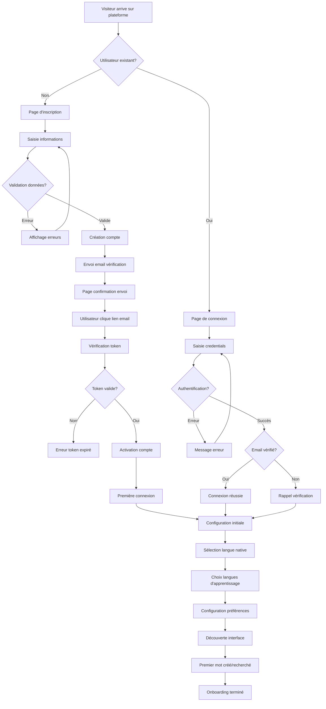
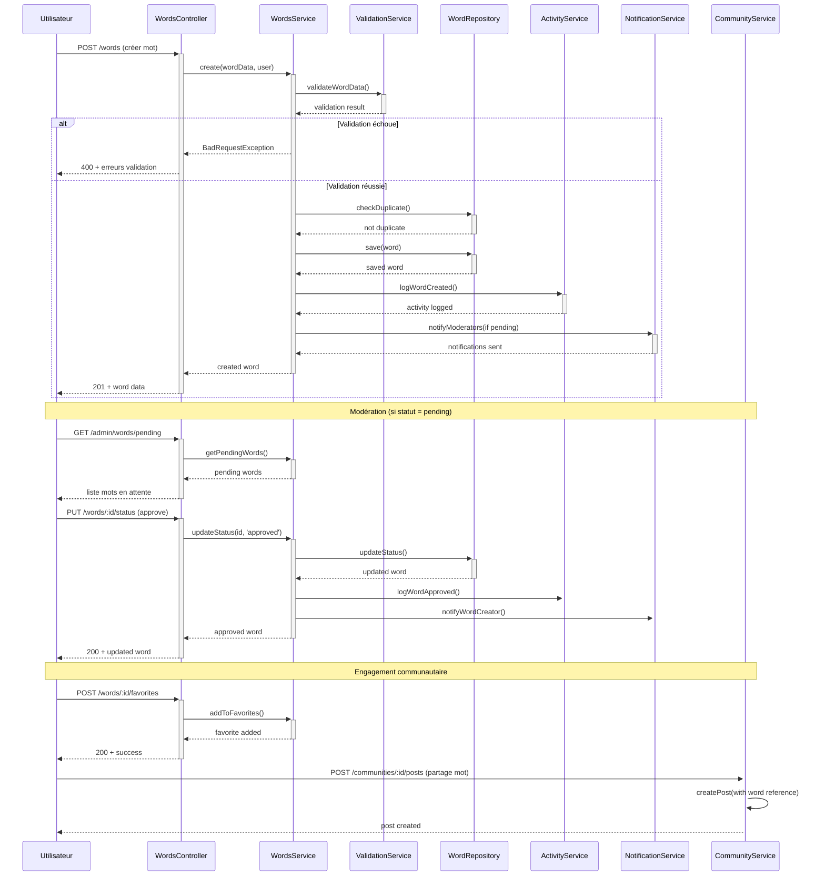
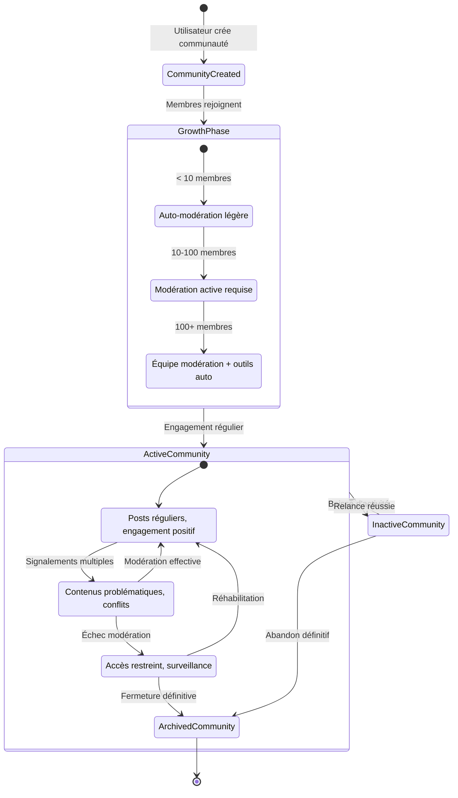
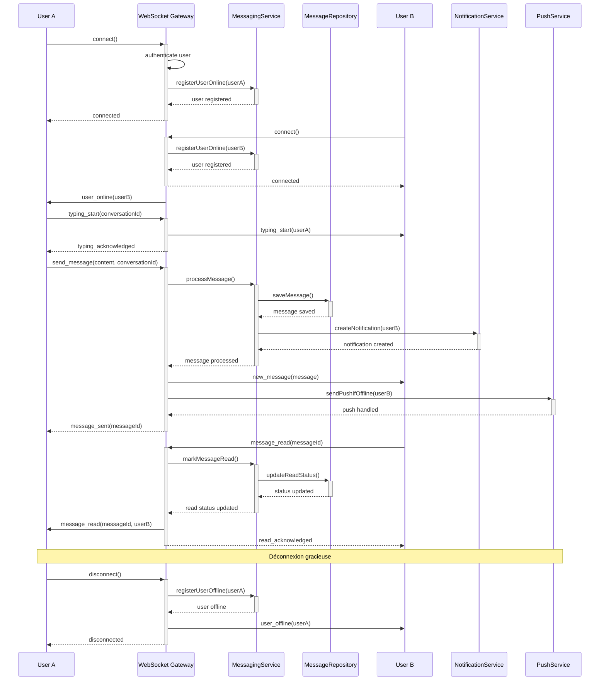
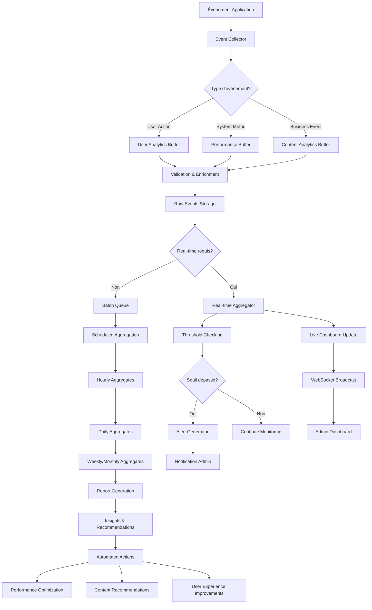
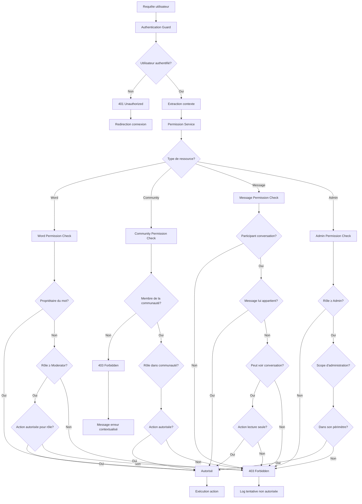
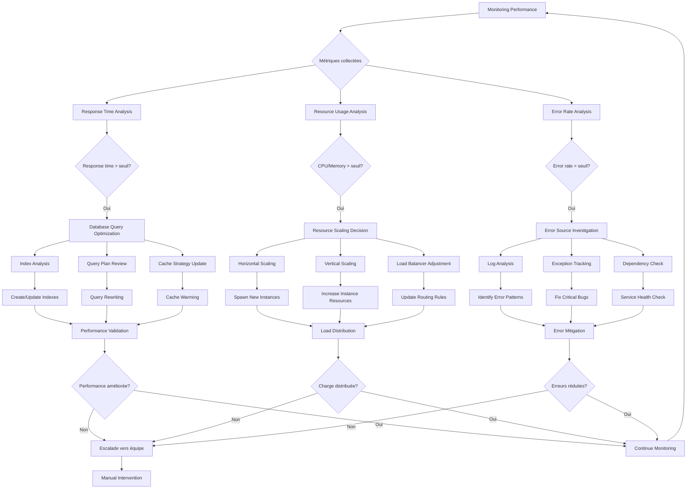

# Diagrammes de Flux Complets - O'Ypunu Backend

## 🌊 Vue d'Ensemble des Flows

Cette documentation présente les diagrammes de flux complets pour tous les parcours utilisateur critiques de la plateforme O'Ypunu, de l'inscription à l'utilisation avancée.

## 🚀 1. Parcours d'Onboarding Complet

### Flow d'Inscription et Activation


## 📚 2. Cycle de Vie d'un Mot dans le Dictionnaire

### Flow Création → Publication → Engagement


## 🌍 3. Dynamiques de Communauté

### Flow Création Communauté → Croissance → Modération


## 💬 4. Messagerie Temps Réel

### Flow Communication Instantanée


## 📊 5. Analytics et Collecte de Données

### Flow Événement → Agrégation → Insights


## 🔄 6. Système de Permissions Cross-Module

### Flow Vérification Permissions Complexes


## 🔐 7. Flow de Sécurité et Audit

### Audit Trail et Détection Anomalies
```mermaid
sequenceDiagram
    participant U as User
    participant App as Application
    participant AS as Audit Service
    participant AD as Anomaly Detector
    participant SM as Security Monitor
    participant Admin as Admin
    participant Alert as Alert System

    U->>+App: Action utilisateur
    App->>+AS: logSecurityEvent()
    AS->>AS: enrichEvent(context, metadata)
    AS->>AS: storeAuditLog()
    AS-->>-App: audit logged
    App-->>-U: response

    AS->>+AD: analyzeEvent()
    AD->>AD: compareWithBaseline()
    AD->>AD: calculateRiskScore()
    
    alt Score risque élevé
        AD->>+SM: flagSuspiciousActivity()
        SM->>SM: correlateWithOtherEvents()
        SM->>SM: assessThreatLevel()
        
        alt Menace confirmée
            SM->>+Alert: triggerSecurityAlert()
            Alert->>Admin: notifyImmediate()
            Alert->>+App: temporaryAccountRestriction()
            App-->>-Alert: restrictions applied
            Alert-->>-SM: alert sent
            SM-->>-AD: threat handled
        else Faux positif
            SM->>SM: updateBaselineModel()
            SM-->>-AD: continue monitoring
        end
    else Score normal
        AD->>AD: updateUserBaseline()
    end
    
    AD-->>-AS: analysis complete

    Note over AS,Admin: Rapport audit périodique
    AS->>AS: generateAuditReport()
    AS->>Admin: weeklySecurityReport()
```

## 📈 8. Scalabilité et Performance

### Flow Optimisation Automatique


## 🎯 Points Clés d'Optimisation

### 1. **Goulots d'Étranglement Identifiés**
- **Database Queries**: Index manquants sur recherches complexes
- **WebSocket Connections**: Limite concurrent connections
- **File Uploads**: Traitement synchrone des gros fichiers
- **Analytics Processing**: Batch processing bloque real-time

### 2. **Solutions Implémentées**
- **Connection Pooling**: Pool optimisé par type de requête
- **Caching Strategy**: Redis pour données fréquemment accédées
- **Async Processing**: Queue system pour tâches lourdes
- **CDN Integration**: Assets statiques distribués globalement

### 3. **Métriques de Performance Cibles**
- **API Response Time**: < 200ms (95th percentile)
- **Database Queries**: < 50ms (moyenne)
- **WebSocket Latency**: < 100ms
- **File Upload**: < 5s (10MB file)
- **Search Results**: < 300ms
- **Page Load Time**: < 2s (initial load)

---

**Version**: 1.0.0  
**Dernière mise à jour**: 30 Juillet 2025  
**Responsable**: Équipe Architecture O'Ypunu