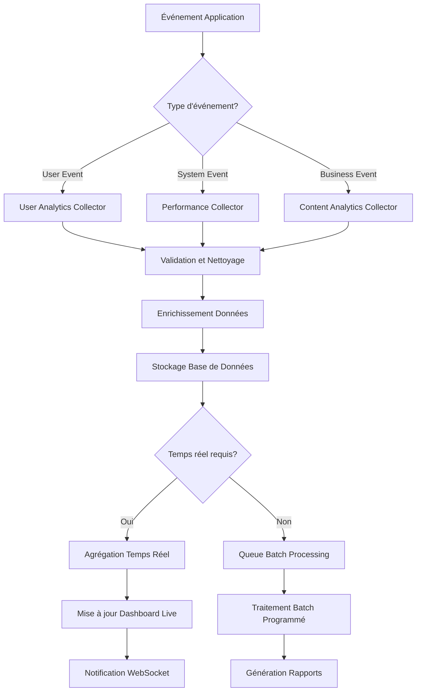
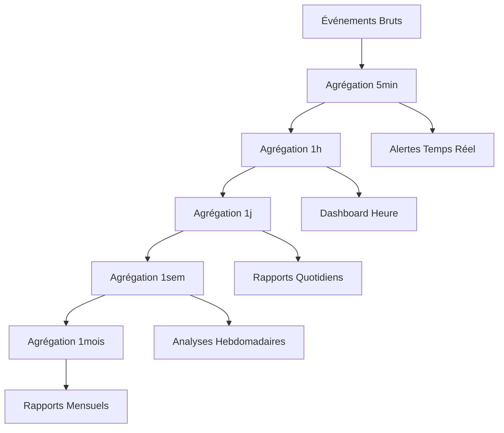

# Module Analytics - Documentation Technique

## 📊 Vue d'Ensemble

Le module `Analytics` fournit un système complet de collecte, analyse et visualisation des données de la plateforme O'Ypunu. Il offre des insights détaillés sur l'utilisation, l'engagement des utilisateurs, la qualité du contenu et les performances du système.

## 📁 Structure du Module

```
src/analytics/
├── controllers/
│   ├── analytics.controller.ts          # API endpoints analytics
│   ├── dashboard.controller.ts          # Données dashboard admin
│   ├── reports.controller.ts            # Génération rapports
│   └── exports.controller.ts            # Export données
├── services/
│   ├── analytics.service.ts             # Service principal
│   ├── data-collection.service.ts       # Collecte données
│   ├── user-analytics.service.ts        # Analytics utilisateurs
│   ├── content-analytics.service.ts     # Analytics contenu
│   ├── performance-analytics.service.ts # Métriques performance
│   ├── language-analytics.service.ts    # Analytics linguistiques
│   └── report-generation.service.ts     # Génération rapports
├── collectors/
│   ├── event.collector.ts               # Collecteur événements
│   ├── metric.collector.ts              # Collecteur métriques
│   ├── performance.collector.ts         # Collecteur performance
│   └── error.collector.ts               # Collecteur erreurs
├── aggregators/
│   ├── daily-aggregator.service.ts      # Agrégation quotidienne
│   ├── weekly-aggregator.service.ts     # Agrégation hebdomadaire
│   ├── monthly-aggregator.service.ts    # Agrégation mensuelle
│   └── real-time-aggregator.service.ts  # Agrégation temps réel
├── schemas/
│   ├── analytics-event.schema.ts        # Événements analytics
│   ├── user-session.schema.ts           # Sessions utilisateur
│   ├── page-view.schema.ts              # Vues de pages
│   ├── feature-usage.schema.ts          # Utilisation features
│   └── performance-metric.schema.ts     # Métriques performance
├── dto/
│   ├── analytics-query.dto.ts           # DTO requêtes analytics
│   ├── report-config.dto.ts             # DTO configuration rapports
│   └── dashboard-filters.dto.ts         # DTO filtres dashboard
├── interfaces/
│   ├── analytics-provider.interface.ts  # Interface providers
│   ├── metric-collector.interface.ts    # Interface collecteurs
│   └── report-exporter.interface.ts     # Interface exporteurs
└── analytics.module.ts                  # Configuration module
```

## 🎯 Responsabilités Principales

### 1. **Collecte de Données Multi-Sources**
- **Événements Utilisateur**: Clics, vues, interactions, conversions
- **Métriques Système**: Performance, erreurs, utilisation ressources
- **Données Métier**: Création contenu, modération, communautés
- **Données Temporelles**: Séries temporelles pour tendances

### 2. **Analytics en Temps Réel**
- **Dashboard Live**: Métriques actualisées en continu
- **Alertes Automatiques**: Notifications sur seuils critiques
- **Monitoring Actif**: Surveillance proactive des KPIs
- **Anomaly Detection**: Détection automatique d'anomalies

### 3. **Insights Métier**
- **Analyse d'Engagement**: Comportement et rétention utilisateurs
- **Performance Contenu**: Qualité et popularité du contenu
- **Efficacité Communautés**: Dynamiques sociales et interactions
- **Apprentissage Linguistique**: Progression et patterns d'usage

### 4. **Reporting et Export**
- **Rapports Automatisés**: Génération programmée de rapports
- **Exports Personnalisés**: Données formatées selon besoins
- **Visualisations**: Graphiques et charts interactifs
- **API Analytics**: Accès programmatique aux données

## 🔧 Schémas de Données

### AnalyticsEvent Schema
```typescript
interface AnalyticsEvent {
  _id: ObjectId;
  
  // Identification événement
  eventType: string;                     // Type d'événement
  eventCategory: 'user' | 'system' | 'business' | 'error';
  eventName: string;                     // Nom spécifique
  
  // Contexte utilisateur
  userId?: ObjectId;                     // Utilisateur concerné
  sessionId: string;                     // Session ID
  userAgent: string;                     // Navigateur/device
  ipAddress: string;                     // Adresse IP (anonymisée)
  
  // Contexte application
  path: string;                          // Page/route
  referrer?: string;                     // Page précédente
  userRole?: string;                     // Rôle utilisateur
  
  // Données événement
  properties: {
    [key: string]: any;                  // Propriétés personnalisées
  };
  
  // Métriques associées
  metrics: {
    duration?: number;                   // Durée action (ms)
    responseTime?: number;               // Temps réponse
    errorCode?: string;                  // Code erreur
    value?: number;                      // Valeur métrique
  };
  
  // Géolocalisation (optionnelle)
  location?: {
    country: string;
    region: string;
    city: string;
    timezone: string;
  };
  
  // Timestamps
  timestamp: Date;                       // Moment événement
  processingTime: Date;                  // Moment traitement
  
  // Métadonnées techniques
  version: string;                       // Version application
  buildId: string;                       // Build ID
  environment: 'development' | 'staging' | 'production';
}
```

### UserSession Schema
```typescript
interface UserSession {
  _id: ObjectId;
  sessionId: string;                     // ID unique session
  userId?: ObjectId;                     // Utilisateur (si connecté)
  
  // Informations session
  startTime: Date;                       // Début session
  endTime?: Date;                        // Fin session
  duration?: number;                     // Durée totale (ms)
  isActive: boolean;                     // Session active
  
  // Device et navigateur
  userAgent: string;
  deviceType: 'desktop' | 'tablet' | 'mobile';
  browserName: string;
  browserVersion: string;
  operatingSystem: string;
  screenResolution: string;
  
  // Géolocalisation
  location: {
    country: string;
    region: string;
    city: string;
    timezone: string;
    coordinates?: [number, number];      // [longitude, latitude]
  };
  
  // Activité session
  pageViews: number;                     // Nombre pages vues
  interactions: number;                  // Nombre interactions
  featuresUsed: string[];                // Features utilisées
  
  // Métriques engagement
  totalScrollDepth: number;              // Profondeur scroll moyenne
  averageTimeOnPage: number;             // Temps moyen par page
  bounceRate: number;                    // Taux rebond
  
  // Parcours utilisateur
  entryPage: string;                     // Page d'entrée
  exitPage?: string;                     // Page de sortie
  referrer?: string;                     // Source trafic
  
  // Conversion et objectifs
  conversions: {
    type: string;                        // Type conversion
    value?: number;                      // Valeur
    timestamp: Date;                     // Moment conversion
  }[];
  
  // Métadonnées
  createdAt: Date;
  updatedAt: Date;
}
```

### PerformanceMetric Schema
```typescript
interface PerformanceMetric {
  _id: ObjectId;
  
  // Identification métrique
  metricType: 'api' | 'database' | 'frontend' | 'system';
  metricName: string;                    // Nom métrique
  endpoint?: string;                     // Endpoint API concerné
  
  // Valeurs métriques
  value: number;                         // Valeur principale
  unit: 'ms' | 'bytes' | 'count' | 'percentage' | 'rate';
  
  // Métriques détaillées
  details: {
    min: number;                         // Valeur minimale
    max: number;                         // Valeur maximale
    avg: number;                         // Moyenne
    p50: number;                         // Médiane
    p95: number;                         // 95e percentile
    p99: number;                         // 99e percentile
    count: number;                       // Nombre échantillons
  };
  
  // Contexte
  environment: 'development' | 'staging' | 'production';
  version: string;                       // Version application
  server?: string;                       // Serveur/instance
  
  // Agrégation temporelle
  timeWindow: '1m' | '5m' | '1h' | '1d'; // Fenêtre temporelle
  aggregationType: 'sum' | 'avg' | 'max' | 'min' | 'count';
  
  // Métadonnées
  timestamp: Date;                       // Moment métrique
  collectedAt: Date;                     // Moment collecte
  tags: { [key: string]: string };       // Tags personnalisés
}
```

## 📊 Types d'Analytics Collectées

### 1. **User Analytics**
```typescript
interface UserAnalytics {
  // Métriques d'engagement
  dailyActiveUsers: number;
  weeklyActiveUsers: number;
  monthlyActiveUsers: number;
  averageSessionDuration: number;
  sessionsPerUser: number;
  
  // Acquisition utilisateurs
  newRegistrations: number;
  registrationSources: SourceStats[];
  conversionFunnel: FunnelStats;
  emailVerificationRate: number;
  
  // Rétention
  dayOneRetention: number;
  daySevenRetention: number;
  dayThirtyRetention: number;
  cohortAnalysis: CohortData[];
  
  // Comportement
  mostVisitedPages: PageStats[];
  featureUsage: FeatureUsageStats[];
  userJourney: JourneyStep[];
  searchQueries: SearchStats[];
  
  // Segmentation
  usersByRole: RoleDistribution;
  usersByLanguage: LanguageDistribution;
  usersByRegion: RegionDistribution;
  deviceDistribution: DeviceStats[];
}
```

### 2. **Content Analytics**
```typescript
interface ContentAnalytics {
  // Métriques contenu
  totalWords: number;
  wordsCreatedToday: number;
  approvalRate: number;
  averageQualityScore: number;
  
  // Engagement contenu
  mostViewedWords: WordStats[];
  mostSearchedWords: SearchStats[];
  popularCategories: CategoryStats[];
  languageDistribution: LanguageStats[];
  
  // Traductions
  translationCompleteness: number;
  translationAccuracy: number;
  languagePairPopularity: LanguagePairStats[];
  
  // Communautés
  activeCommunities: number;
  postsPerCommunity: number;
  communityEngagement: CommunityEngagementStats[];
  
  // Qualité
  moderationQueue: number;
  reportedContent: number;
  spamDetectionRate: number;
  userGeneratedContentQuality: QualityMetrics;
}
```

### 3. **Performance Analytics**
```typescript
interface PerformanceAnalytics {
  // API Performance
  averageResponseTime: number;
  apiErrorRate: number;
  requestsPerSecond: number;
  slowestEndpoints: EndpointStats[];
  
  // Database Performance
  averageQueryTime: number;
  slowQueries: QueryStats[];
  connectionPoolUsage: number;
  databaseErrors: number;
  
  // Frontend Performance
  pageLoadTime: number;
  timeToInteractive: number;
  largestContentfulPaint: number;
  cumulativeLayoutShift: number;
  
  // Infrastructure
  serverLoad: number;
  memoryUsage: number;
  diskUsage: number;
  networkLatency: number;
  
  // Availability
  uptime: number;
  errorRate: number;
  incidentCount: number;
  meanTimeToRecovery: number;
}
```

## 📈 Services Analytics

### AnalyticsService Principal
```typescript
@Injectable()
export class AnalyticsService {
  constructor(
    private dataCollectionService: DataCollectionService,
    private userAnalyticsService: UserAnalyticsService,
    private contentAnalyticsService: ContentAnalyticsService,
    private performanceAnalyticsService: PerformanceAnalyticsService
  ) {}

  /**
   * Collecte un événement analytics
   */
  async trackEvent(event: AnalyticsEventDto): Promise<void> {
    await this.dataCollectionService.collectEvent({
      ...event,
      timestamp: new Date(),
      processingTime: new Date()
    });
    
    // Traitement temps réel si nécessaire
    if (event.isRealTime) {
      await this.processRealTimeEvent(event);
    }
  }

  /**
   * Génère un dashboard complet
   */
  async generateDashboard(
    timeRange: TimeRange,
    filters: DashboardFilters
  ): Promise<DashboardData> {
    const [userMetrics, contentMetrics, performanceMetrics] = await Promise.all([
      this.userAnalyticsService.getUserMetrics(timeRange, filters),
      this.contentAnalyticsService.getContentMetrics(timeRange, filters),
      this.performanceAnalyticsService.getPerformanceMetrics(timeRange, filters)
    ]);

    return {
      overview: this.buildOverviewMetrics(userMetrics, contentMetrics),
      user: userMetrics,
      content: contentMetrics,
      performance: performanceMetrics,
      alerts: await this.getActiveAlerts(),
      trends: await this.calculateTrends(timeRange)
    };
  }

  /**
   * Génère un rapport personnalisé
   */
  async generateReport(config: ReportConfig): Promise<AnalyticsReport> {
    const reportData = await this.collectReportData(config);
    
    return {
      id: uuidv4(),
      title: config.title,
      description: config.description,
      timeRange: config.timeRange,
      data: reportData,
      visualizations: await this.generateVisualizations(reportData, config),
      insights: await this.generateInsights(reportData),
      generatedAt: new Date(),
      format: config.format
    };
  }
}
```

### Real-Time Analytics
```typescript
@Injectable()
export class RealTimeAnalyticsService {
  private realtimeMetrics = new Map<string, any>();
  
  async updateRealTimeMetrics(event: AnalyticsEvent): Promise<void> {
    // Mise à jour métriques temps réel
    await Promise.all([
      this.updateActiveUsers(event),
      this.updatePageViews(event),
      this.updateAPIMetrics(event),
      this.updateErrorRates(event)
    ]);
    
    // Emit to WebSocket clients
    this.websocketService.broadcastMetrics(this.getCurrentMetrics());
  }
  
  async checkThresholds(metrics: any): Promise<void> {
    const alerts = [];
    
    // Vérification seuils critiques
    if (metrics.errorRate > 0.05) {
      alerts.push({
        type: 'error_rate_high',
        severity: 'critical',
        value: metrics.errorRate,
        threshold: 0.05
      });
    }
    
    if (metrics.responseTime > 1000) {
      alerts.push({
        type: 'response_time_high',
        severity: 'warning',
        value: metrics.responseTime,
        threshold: 1000
      });
    }
    
    // Enverr des alertes
    for (const alert of alerts) {
      await this.alertService.sendAlert(alert);
    }
  }
}
```

## 📊 Endpoints API

### Analytics Queries

| Endpoint | Method | Description | Guards | Rate Limit |
|----------|--------|-------------|---------|------------|
| `/analytics/dashboard` | GET | Dashboard principal | JWT + ADMIN | 100/min |
| `/analytics/users` | GET | Métriques utilisateurs | JWT + ADMIN | 50/min |
| `/analytics/content` | GET | Métriques contenu | JWT + ADMIN | 50/min |
| `/analytics/performance` | GET | Métriques performance | JWT + ADMIN | 50/min |
| `/analytics/real-time` | GET | Métriques temps réel | JWT + ADMIN | 200/min |

### Reports Generation

| Endpoint | Method | Description | Guards | Rate Limit |
|----------|--------|-------------|---------|------------|
| `/reports` | POST | Générer rapport personnalisé | JWT + ADMIN | 10/hour |
| `/reports/:id` | GET | Récupérer rapport généré | JWT + ADMIN | 50/min |
| `/reports/:id/export` | GET | Exporter rapport (PDF/Excel) | JWT + ADMIN | 20/hour |
| `/reports/scheduled` | GET | Liste rapports programmés | JWT + ADMIN | 20/min |

### Data Export

| Endpoint | Method | Description | Guards | Rate Limit |
|----------|--------|-------------|---------|------------|
| `/analytics/export/users` | GET | Export données utilisateurs | JWT + SUPERADMIN | 5/hour |
| `/analytics/export/events` | GET | Export événements analytics | JWT + SUPERADMIN | 3/hour |
| `/analytics/export/custom` | POST | Export personnalisé | JWT + SUPERADMIN | 2/hour |

## 🔄 Processus de Collecte

### 1. **Pipeline de Collecte de Données**


### 2. **Agrégation Multi-Niveaux**


## 🚨 Alertes et Monitoring

### Système d'Alertes Automatiques
```typescript
@Injectable()
export class AlertingService {
  private alertRules: AlertRule[] = [
    {
      name: 'high_error_rate',
      metric: 'api.error_rate',
      threshold: 0.05,
      operator: '>',
      severity: 'critical',
      window: '5m'
    },
    {
      name: 'low_user_engagement',
      metric: 'user.daily_active_users',
      threshold: 100,
      operator: '<',
      severity: 'warning',
      window: '1d'
    },
    {
      name: 'high_response_time',
      metric: 'api.response_time_p95',
      threshold: 2000,
      operator: '>',
      severity: 'warning',
      window: '10m'
    }
  ];

  async evaluateAlerts(): Promise<void> {
    for (const rule of this.alertRules) {
      const currentValue = await this.getMetricValue(rule.metric, rule.window);
      
      if (this.evaluateThreshold(currentValue, rule.threshold, rule.operator)) {
        await this.triggerAlert({
          rule: rule.name,
          currentValue,
          threshold: rule.threshold,
          severity: rule.severity,
          timestamp: new Date()
        });
      }
    }
  }
}
```

## 🎯 Insights et Machine Learning

### Détection d'Anomalies
```typescript
@Injectable()
export class AnomalyDetectionService {
  async detectAnomalies(metric: string, timeRange: TimeRange): Promise<Anomaly[]> {
    const historicalData = await this.getHistoricalData(metric, timeRange);
    const model = await this.trainAnomalyModel(historicalData);
    
    const recentData = await this.getRecentData(metric);
    const anomalies = model.detect(recentData);
    
    return anomalies.map(anomaly => ({
      metric,
      timestamp: anomaly.timestamp,
      value: anomaly.value,
      expectedValue: anomaly.expected,
      deviation: anomaly.deviation,
      severity: this.calculateSeverity(anomaly.deviation),
      confidence: anomaly.confidence
    }));
  }
}
```

### Prédictions et Tendances
```typescript
@Injectable()
export class PredictionService {
  async predictUserGrowth(horizon: number): Promise<GrowthPrediction> {
    const historicalGrowth = await this.getUserGrowthHistory();
    const seasonality = this.detectSeasonality(historicalGrowth);
    const trend = this.calculateTrend(historicalGrowth);
    
    return {
      predictedUsers: this.forecastUsers(trend, seasonality, horizon),
      confidence: this.calculateConfidence(historicalGrowth),
      factors: this.identifyGrowthFactors(historicalGrowth),
      recommendations: this.generateRecommendations(trend, seasonality)
    };
  }
}
```

## 🧪 Tests et Qualité

### Scénarios de Tests Critiques
```typescript
describe('AnalyticsService', () => {
  describe('Data Collection', () => {
    it('should collect events with proper validation');
    it('should handle high volume event ingestion');
    it('should enrich events with contextual data');
    it('should maintain data integrity during collection');
  });
  
  describe('Real-time Processing', () => {
    it('should update metrics in real-time');
    it('should trigger alerts when thresholds exceeded');
    it('should handle concurrent metric updates');
    it('should maintain consistency across aggregations');
  });
  
  describe('Report Generation', () => {
    it('should generate accurate reports');
    it('should handle large dataset exports');
    it('should respect user permissions for data access');
    it('should optimize query performance');
  });
  
  describe('Performance', () => {
    it('should process 10k+ events per second');
    it('should generate dashboards within 2 seconds');
    it('should maintain 99.9% data accuracy');
    it('should handle historical data efficiently');
  });
});
```

### Performance Benchmarks
- **Event Ingestion**: 10,000+ events/second
- **Dashboard Load**: < 2 seconds
- **Report Generation**: < 30 seconds (standard reports)
- **Real-time Updates**: < 100ms latency
- **Data Accuracy**: 99.9%+

---

**Version**: 1.0.0  
**Dernière mise à jour**: 30 Juillet 2025  
**Responsable**: Équipe Data & Analytics O'Ypunu