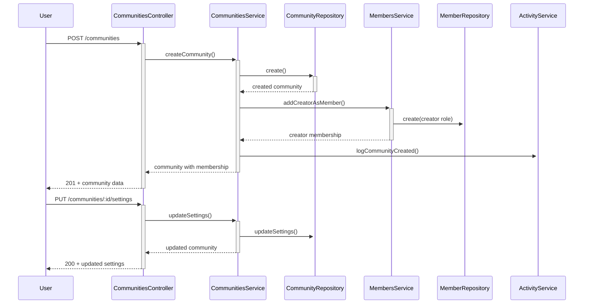
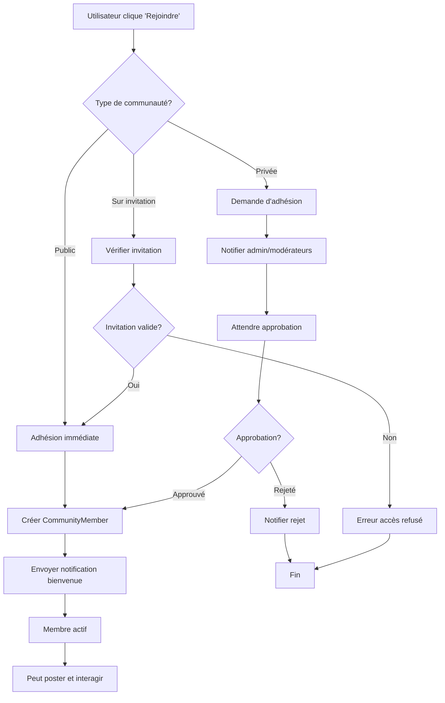
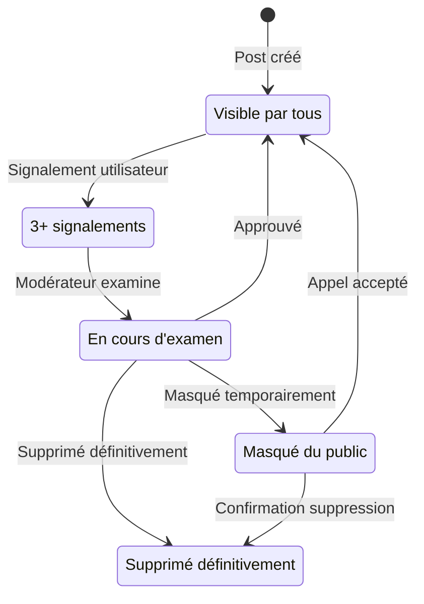

# Module Communities - Documentation Technique

## 🌍 Vue d'Ensemble

Le module `Communities` constitue le cœur social de la plateforme O'Ypunu. Il permet la création et gestion de communautés linguistiques, l'organisation de discussions thématiques, et la collaboration entre apprenants de langues africaines.

## 📁 Structure du Module

```
src/communities/
├── controllers/
│   ├── communities.controller.ts        # CRUD communautés
│   ├── posts.controller.ts              # Posts de communauté
│   ├── members.controller.ts            # Gestion membres
│   └── events.controller.ts             # Événements communautaires
├── dto/
│   ├── create-community.dto.ts          # DTO création communauté
│   ├── update-community.dto.ts          # DTO mise à jour
│   ├── create-post.dto.ts               # DTO création post
│   ├── join-community.dto.ts            # DTO adhésion
│   └── community-settings.dto.ts        # DTO paramètres
├── schemas/
│   ├── community.schema.ts              # Schéma principal communauté
│   ├── community-post.schema.ts         # Posts communautaires
│   ├── community-member.schema.ts       # Membres et rôles
│   ├── post-comment.schema.ts           # Commentaires posts
│   └── community-event.schema.ts        # Événements
├── services/
│   ├── communities.service.ts           # Service principal
│   ├── posts.service.ts                 # Gestion posts
│   ├── members.service.ts               # Gestion membres
│   ├── moderation.service.ts            # Modération communauté
│   └── analytics.service.ts             # Analytics communautaires
├── guards/
│   ├── community-member.guard.ts        # Vérification membre
│   ├── community-moderator.guard.ts     # Vérification modérateur
│   └── community-admin.guard.ts         # Vérification admin
└── communities.module.ts                # Configuration module
```

## 🎯 Responsabilités Principales

### 1. **Gestion des Communautés**
- **Création Libre**: Tout utilisateur peut créer une communauté
- **Types Variés**: Communautés par langue, région, niveau, intérêts
- **Paramétrage Flexible**: Publique/privée, modération, règles personnalisées
- **Découverte**: Recherche et recommandations de communautés

### 2. **Système de Membres et Rôles**
- **Hiérarchie**: Member → Moderator → Admin → Creator
- **Permissions Granulaires**: Poster, modérer, inviter, configurer
- **Adhésion Flexible**: Libre, sur invitation, ou approbation requise
- **Gestion des Bannissements**: Exclusion temporaire ou permanente

### 3. **Contenu et Discussions**
- **Posts Structurés**: Texte, images, liens, mots du dictionnaire
- **Commentaires Imbriqués**: Discussions organisées par thread
- **Système de Votes**: Upvote/downvote pour le contenu
- **Tags et Catégories**: Organisation thématique du contenu

### 4. **Événements et Activités**
- **Événements Programmés**: Cours, discussions, challenges
- **Défis Linguistiques**: Compétitions d'apprentissage
- **Sessions Live**: Intégration potentielle streaming
- **Calendrier Communautaire**: Planning des activités

## 🔧 Schémas de Données

### Community Schema Principal
```typescript
interface Community {
  _id: ObjectId;
  name: string;                          // Nom unique de la communauté
  slug: string;                          // URL-friendly identifier
  description: string;                   // Description courte
  longDescription?: string;              // Description détaillée
  
  // Identification et branding
  avatar?: string;                       // Logo/image communauté
  banner?: string;                       // Image bannière
  color?: string;                        // Couleur thème
  tags: string[];                        // Tags descriptifs
  
  // Configuration
  type: 'language' | 'region' | 'topic' | 'level'; // Type de communauté
  primaryLanguage: ObjectId;             // Langue principale
  supportedLanguages: ObjectId[];        // Langues supportées
  visibility: 'public' | 'private' | 'invite-only'; // Visibilité
  
  // Règles et modération
  rules: string[];                       // Règles de la communauté
  moderationLevel: 'low' | 'medium' | 'high'; // Niveau modération
  allowPosts: boolean;                   // Autoriser posts membres
  requireApproval: boolean;              // Approbation posts requis
  
  // Statistiques
  stats: {
    memberCount: number;                 // Nombre de membres
    postCount: number;                   // Nombre de posts
    activeMembers: number;               // Membres actifs (30j)
    engagementRate: number;              // Taux d'engagement
  };
  
  // Métadonnées
  createdBy: ObjectId;                   // Créateur
  createdAt: Date;
  updatedAt: Date;
  lastActivity: Date;                    // Dernière activité
  
  // Paramètres avancés
  settings: {
    welcomeMessage?: string;             // Message d'accueil
    autoModeration: boolean;             // Modération automatique
    allowExternalLinks: boolean;         // Liens externes autorisés
    notificationSettings: {
      newPosts: boolean;
      newMembers: boolean;
      moderationAlerts: boolean;
    };
  };
}
```

### CommunityMember Schema
```typescript
interface CommunityMember {
  _id: ObjectId;
  communityId: ObjectId;                 // Référence communauté
  userId: ObjectId;                      // Référence utilisateur
  
  // Rôle et permissions
  role: 'member' | 'moderator' | 'admin' | 'creator';
  permissions: {
    canPost: boolean;
    canComment: boolean;
    canModerate: boolean;
    canInvite: boolean;
    canManageRoles: boolean;
    canEditSettings: boolean;
  };
  
  // Métadonnées membre
  joinedAt: Date;
  lastActivity: Date;
  contributionScore: number;             // Score contributions
  
  // Statut et restrictions
  status: 'active' | 'banned' | 'muted' | 'pending';
  banReason?: string;
  banExpiresAt?: Date;
  
  // Personnalisation
  customTitle?: string;                  // Titre personnalisé
  displayName?: string;                  // Nom d'affichage dans la communauté
  
  // Statistiques personnelles
  stats: {
    postsCreated: number;
    commentsAdded: number;
    votesReceived: number;
    helpfulAnswers: number;
  };
}
```

### CommunityPost Schema
```typescript
interface CommunityPost {
  _id: ObjectId;
  communityId: ObjectId;                 // Communauté parente
  authorId: ObjectId;                    // Auteur du post
  
  // Contenu
  title: string;                         // Titre du post
  content: string;                       // Contenu principal
  contentType: 'text' | 'rich' | 'markdown'; // Type de contenu
  
  // Médias attachés
  attachments: {
    images?: string[];                   // URLs images
    links?: {
      url: string;
      title: string;
      description: string;
    }[];
    relatedWords?: ObjectId[];           // Mots du dictionnaire liés
  };
  
  // Classification
  category?: string;                     // Catégorie du post
  tags: string[];                        // Tags du post
  isPinned: boolean;                     // Post épinglé
  isAnnouncement: boolean;               // Annonce officielle
  
  // Modération
  status: 'published' | 'pending' | 'hidden' | 'removed';
  moderatedBy?: ObjectId;                // Modérateur
  moderationReason?: string;             // Raison modération
  reportCount: number;                   // Nombre signalements
  
  // Engagement
  votes: {
    upvotes: number;
    downvotes: number;
    netScore: number;
  };
  commentCount: number;                  // Nombre commentaires
  viewCount: number;                     // Nombre vues
  
  // Timestamps
  createdAt: Date;
  updatedAt: Date;
  lastActivity: Date;                    // Dernière activité (commentaire)
}
```

### PostComment Schema
```typescript
interface PostComment {
  _id: ObjectId;
  postId: ObjectId;                      // Post parent
  communityId: ObjectId;                 // Communauté
  authorId: ObjectId;                    // Auteur commentaire
  
  // Hiérarchie commentaires
  parentCommentId?: ObjectId;            // Commentaire parent (réponse)
  threadLevel: number;                   // Niveau imbrication (0-5)
  
  // Contenu
  content: string;                       // Texte commentaire
  contentType: 'text' | 'rich';         // Type contenu
  mentions: ObjectId[];                  // Utilisateurs mentionnés
  
  // Modération
  status: 'published' | 'pending' | 'hidden' | 'removed';
  reportCount: number;
  moderatedBy?: ObjectId;
  
  // Engagement
  votes: {
    upvotes: number;
    downvotes: number;
  };
  
  // Métadonnées
  isEdited: boolean;
  editedAt?: Date;
  createdAt: Date;
}
```

## 📊 Endpoints API

### Communities Management

| Endpoint | Method | Description | Guards | Rate Limit |
|----------|--------|-------------|---------|------------|
| `/communities` | GET | Liste communautés publiques | Optional JWT | 100/min |
| `/communities` | POST | Créer nouvelle communauté | JWT | 3/hour |
| `/communities/:id` | GET | Détails communauté | Optional JWT | 200/min |
| `/communities/:id` | PUT | Modifier communauté | JWT + Admin | 10/hour |
| `/communities/:id` | DELETE | Supprimer communauté | JWT + Creator | 1/day |
| `/communities/search` | GET | Recherche communautés | Optional JWT | 50/min |
| `/communities/recommended` | GET | Communautés recommandées | JWT | 20/min |

### Members Management  

| Endpoint | Method | Description | Guards | Rate Limit |
|----------|--------|-------------|---------|------------|
| `/communities/:id/join` | POST | Rejoindre communauté | JWT | 10/hour |
| `/communities/:id/leave` | POST | Quitter communauté | JWT | 5/hour |
| `/communities/:id/members` | GET | Liste membres | JWT + Member | 50/min |
| `/communities/:id/members/:userId` | PUT | Modifier rôle membre | JWT + Admin | 20/hour |
| `/communities/:id/members/:userId/ban` | POST | Bannir membre | JWT + Moderator | 10/hour |
| `/communities/:id/invite` | POST | Inviter utilisateur | JWT + Member | 20/hour |

### Posts Management

| Endpoint | Method | Description | Guards | Rate Limit |
|----------|--------|-------------|---------|------------|
| `/communities/:id/posts` | GET | Posts de la communauté | Optional JWT | 200/min |
| `/communities/:id/posts` | POST | Créer nouveau post | JWT + Member | 20/hour |
| `/communities/:id/posts/:postId` | GET | Détails post + commentaires | Optional JWT | 100/min |
| `/communities/:id/posts/:postId` | PUT | Modifier post | JWT + Author | 10/hour |
| `/communities/:id/posts/:postId` | DELETE | Supprimer post | JWT + Author/Mod | 5/hour |
| `/communities/:id/posts/:postId/vote` | POST | Voter pour post | JWT + Member | 100/hour |

### Comments Management

| Endpoint | Method | Description | Guards | Rate Limit |
|----------|--------|-------------|---------|------------|
| `/communities/:id/posts/:postId/comments` | GET | Commentaires du post | Optional JWT | 200/min |
| `/communities/:id/posts/:postId/comments` | POST | Ajouter commentaire | JWT + Member | 50/hour |
| `/communities/:id/posts/:postId/comments/:commentId` | PUT | Modifier commentaire | JWT + Author | 20/hour |
| `/communities/:id/posts/:postId/comments/:commentId` | DELETE | Supprimer commentaire | JWT + Author/Mod | 10/hour |
| `/communities/:id/posts/:postId/comments/:commentId/vote` | POST | Voter commentaire | JWT + Member | 200/hour |

## 🔄 Flows Principaux

### 1. Création et Configuration de Communauté


### 2. Workflow d'Adhésion à une Communauté


### 3. Système de Modération Communautaire


## 🛡️ Système de Permissions

### Matrix des Permissions par Rôle
```typescript
const CommunityPermissions = {
  member: {
    canView: true,
    canPost: true,
    canComment: true,
    canVote: true,
    canReport: true,
    canInvite: false,
    canModerate: false,
    canManageMembers: false,
    canEditSettings: false
  },
  moderator: {
    canView: true,
    canPost: true,
    canComment: true,
    canVote: true,
    canReport: true,
    canInvite: true,
    canModerate: true,
    canManageMembers: true,
    canEditSettings: false
  },
  admin: {
    canView: true,
    canPost: true,
    canComment: true,
    canVote: true,
    canReport: true,
    canInvite: true,
    canModerate: true,
    canManageMembers: true,
    canEditSettings: true
  },
  creator: {
    // Toutes les permissions + delete community
    ...admin,
    canDeleteCommunity: true,
    canTransferOwnership: true
  }
};
```

### Guards de Sécurité
```typescript
@Injectable()
export class CommunityMemberGuard implements CanActivate {
  async canActivate(context: ExecutionContext): Promise<boolean> {
    const request = context.switchToHttp().getRequest();
    const { user } = request;
    const { communityId } = request.params;

    if (!user) return false;

    const membership = await this.membersService.findMembership(
      communityId, 
      user.id
    );

    return membership && membership.status === 'active';
  }
}

@Injectable()
export class CommunityModeratorGuard implements CanActivate {
  async canActivate(context: ExecutionContext): Promise<boolean> {
    const request = context.switchToHttp().getRequest();
    const { user } = request;
    const { communityId } = request.params;

    const membership = await this.membersService.findMembership(
      communityId, 
      user.id
    );

    return membership && 
           ['moderator', 'admin', 'creator'].includes(membership.role) &&
           membership.status === 'active';
  }
}
```

## 📈 Analytics et Métriques

### Métriques Communautaires
```typescript
interface CommunityAnalytics {
  // Croissance
  newMembersToday: number;
  newMembersThisWeek: number;
  memberRetentionRate: number;
  churnRate: number;
  
  // Engagement
  dailyActiveMembers: number;
  postsPerDay: number;
  commentsPerPost: number;
  averageEngagementRate: number;
  
  // Contenu
  topPosts: PostStats[];
  popularTags: TagStats[];
  contentTypeDistribution: ContentTypeStats;
  
  // Modération
  reportedPostsCount: number;
  moderationActionsTaken: number;
  averageModerationTime: number;
  bannedMembersCount: number;
  
  // Recommandations
  recommendedCommunities: Community[];
  similarCommunities: Community[];
  crossCommunityActivity: number;
}

@Injectable()
export class CommunityAnalyticsService {
  async generateCommunityReport(
    communityId: string,
    period: string
  ): Promise<CommunityAnalytics> {
    // Calculs métriques détaillés
    const [growth, engagement, content, moderation] = await Promise.all([
      this.calculateGrowthMetrics(communityId, period),
      this.calculateEngagementMetrics(communityId, period),
      this.calculateContentMetrics(communityId, period),
      this.calculateModerationMetrics(communityId, period)
    ]);
    
    return {
      ...growth,
      ...engagement,
      ...content,
      ...moderation
    };
  }
}
```

## 🔧 Fonctionnalités Avancées

### Système de Recommandations
```typescript
@Injectable()
export class CommunityRecommendationService {
  async getRecommendedCommunities(userId: string): Promise<Community[]> {
    const user = await this.userService.findById(userId);
    
    // Recommandations basées sur :
    // 1. Langues d'apprentissage de l'utilisateur
    // 2. Communautés des amis/contacts
    // 3. Historique d'activité sur les mots
    // 4. Similarité avec autres utilisateurs
    
    const languageBasedCommunities = await this.findByLanguages(
      user.learningLanguageIds
    );
    
    const socialBasedCommunities = await this.findBySocialConnections(userId);
    
    const activityBasedCommunities = await this.findByWordActivity(userId);
    
    // Algorithme de scoring et déduplication
    return this.scoreAndMergeCommunities([
      ...languageBasedCommunities,
      ...socialBasedCommunities,
      ...activityBasedCommunities
    ]);
  }
}
```

### Notifications Intelligentes
```typescript
@Injectable()
export class CommunityNotificationService {
  async processNotifications(): Promise<void> {
    // Notifications en temps réel pour :
    // - Nouveau post dans communauté suivie
    // - Réponse à son commentaire
    // - Mention dans un post/commentaire
    // - Nouveau membre rejoint
    // - Post épinglé par modérateur
    
    const activeUsers = await this.getActiveUsers();
    
    for (const user of activeUsers) {
      const notifications = await this.generateUserNotifications(user.id);
      await this.sendNotifications(user, notifications);
    }
  }
}
```

## 🧪 Tests et Qualité

### Scénarios de Tests Critiques
```typescript
describe('CommunitiesService', () => {
  describe('Community Creation', () => {
    it('should create community with creator as admin');
    it('should generate unique slug from name');
    it('should validate community settings');
    it('should handle duplicate names gracefully');
  });
  
  describe('Membership Management', () => {
    it('should add member with correct role');
    it('should prevent duplicate memberships');
    it('should handle role promotions correctly');
    it('should manage banned members properly');
  });
  
  describe('Content Moderation', () => {
    it('should auto-moderate reported content');
    it('should respect community rules');
    it('should notify moderators of violations');
    it('should maintain moderation audit trail');
  });
  
  describe('Permissions and Security', () => {
    it('should enforce role-based permissions');
    it('should prevent unauthorized actions');
    it('should validate community visibility rules');
    it('should handle private community access');
  });
});
```

---

**Version**: 1.0.0  
**Dernière mise à jour**: 30 Juillet 2025  
**Responsable**: Équipe Social O'Ypunu