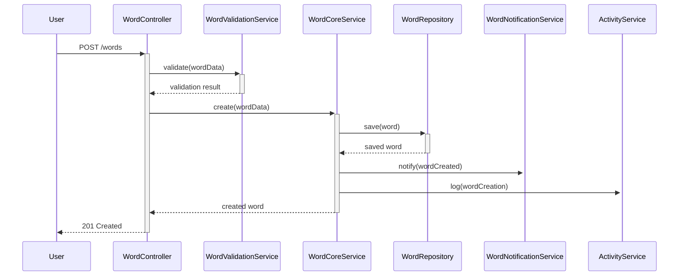
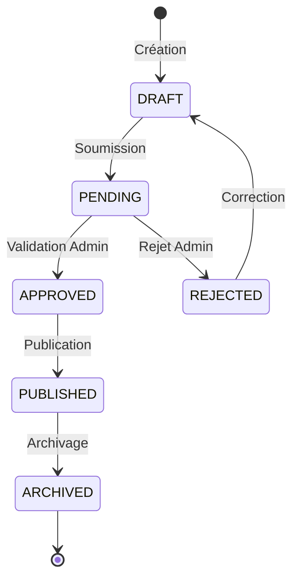
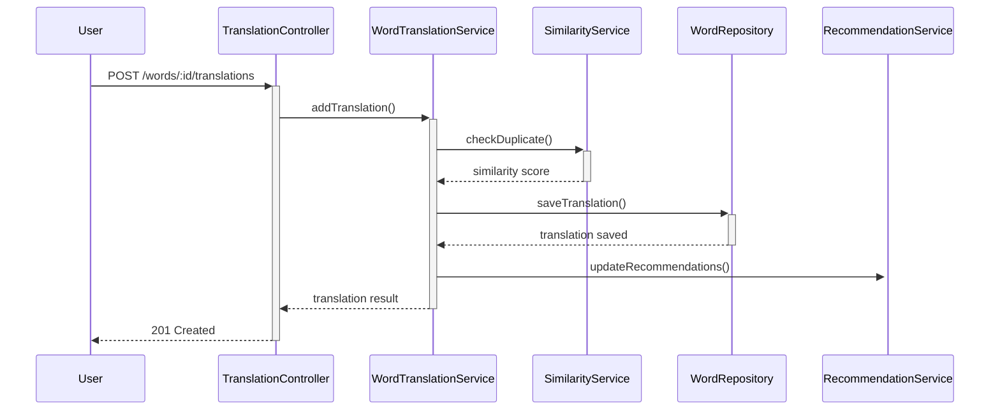

# Module Dictionary - Documentation Technique

## 📚 Vue d'Ensemble

Le module `Dictionary` constitue le cœur métier de la plateforme O'Ypunu. Il gère l'ensemble du système de dictionnaire collaboratif, incluant les mots, traductions, catégories, révisions, et fichiers audio. Ce module implémente une architecture modulaire avec des services spécialisés pour chaque aspect fonctionnel.

## 📁 Structure du Module

```
src/dictionary/
├── controllers/
│   ├── categories.controller.ts        # Gestion des catégories
│   ├── words.controller.ts             # CRUD mots principal
│   ├── words-admin.controller.ts       # Actions administrateur
│   ├── words-analytics.controller.ts   # Statistiques et métriques
│   ├── words-audio.controller.ts       # Upload/lecture audio
│   ├── words-core.controller.ts        # Opérations de base
│   ├── words-permission.controller.ts  # Gestion permissions
│   ├── words-revision.controller.ts    # Historique révisions
│   └── words-translation.controller.ts # Traductions
├── dto/
│   ├── create-category.dto.ts          # DTO création catégorie
│   ├── create-word.dto.ts              # DTO création mot
│   ├── create-word-formdata.dto.ts     # DTO avec fichiers
│   ├── search-words.dto.ts             # DTO recherche
│   ├── update-category.dto.ts          # DTO mise à jour catégorie
│   └── update-word.dto.ts              # DTO mise à jour mot
├── interfaces/
│   ├── word-notification.interface.ts  # Interface notifications
│   ├── word-permission.interface.ts    # Interface permissions
│   └── word-translation.interface.ts   # Interface traductions
├── middlewares/
│   └── audio-security.middleware.ts    # Sécurité fichiers audio
├── schemas/
│   ├── category.schema.ts              # Schéma catégories
│   ├── favorite-word.schema.ts         # Schéma mots favoris
│   ├── revision-history.schema.ts      # Schéma historique
│   ├── word-notification.schema.ts     # Schéma notifications
│   └── word.schema.ts                  # Schéma principal mot
├── services/
│   ├── audio-cache.service.ts          # Cache fichiers audio
│   ├── audio-monitoring.service.ts     # Monitoring audio
│   ├── audio.service.ts                # Gestion audio
│   ├── categories.service.ts           # Gestion catégories
│   ├── words.service.ts                # Service principal
│   └── word-services/                  # Services spécialisés
│       ├── word-analytics.service.ts   # Analytiques
│       ├── word-audio.service.ts       # Audio spécialisé
│       ├── word-core.service.ts        # Opérations de base
│       ├── word-favorite.service.ts    # Gestion favoris
│       ├── word-notification.service.ts # Notifications
│       ├── word-permission.service.ts   # Permissions
│       ├── word-revision.service.ts     # Révisions
│       ├── word-translation.service.ts  # Traductions
│       └── word-validation.service.ts   # Validation
└── dictionary.module.ts               # Configuration module
```

## 🎯 Responsabilités Principales

### 1. **Gestion des Mots**
- **CRUD Complet**: Création, lecture, mise à jour, suppression
- **Validation**: Contrôle qualité et cohérence
- **Versioning**: Historique des modifications
- **Status Management**: Workflow d'approbation

### 2. **Système de Traductions**
- **Multi-langues**: Support langues africaines prioritaires
- **Traductions Multiples**: Plusieurs traductions par mot
- **Validation Collaborative**: Système de votes
- **Détection Doublons**: Algorithmes de similarité

### 3. **Catégorisation**
- **Hiérarchie Flexible**: Catégories et sous-catégories
- **Classification Automatique**: IA pour suggestion catégories
- **Tags Dynamiques**: Étiquetage libre et structuré

### 4. **Contenu Multimédia**
- **Audio Pronunciation**: Upload et lecture
- **Compression Automatique**: Optimisation fichiers
- **Formats Multiples**: Support MP3, WAV, OGG
- **Sécurité**: Validation et scan malware

## 🔧 Flow Principal

### 1. **Création de Mot**


### 2. **Workflow d'Approbation**


### 3. **Processus de Traduction**


## 🛡️ Endpoints API

### Words Core Endpoints

| Endpoint | Method | Description | Guards | Rate Limit |
|----------|--------|-------------|---------|------------|
| `/words` | GET | Liste mots avec pagination | Optional JWT | 100/min |
| `/words` | POST | Créer nouveau mot | JWT + CONTRIBUTOR | 10/hour |
| `/words/:id` | GET | Détails mot spécifique | Optional JWT | 200/min |
| `/words/:id` | PATCH | Modifier mot existant | JWT + Owner | 20/hour |
| `/words/:id` | DELETE | Supprimer mot | JWT + ADMIN | 5/hour |
| `/words/search` | GET | Recherche avancée | Optional JWT | 300/min |

### Translation Endpoints

| Endpoint | Method | Description | Guards | Rate Limit |
|----------|--------|-------------|---------|------------|
| `/words/:id/translations` | GET | Liste traductions | None | 200/min |
| `/words/:id/translations` | POST | Ajouter traduction | JWT + CONTRIBUTOR | 20/hour |
| `/words/:id/translations/:translationId` | PATCH | Modifier traduction | JWT + Owner | 10/hour |
| `/words/:id/translations/:translationId` | DELETE | Supprimer traduction | JWT + Owner/ADMIN | 5/hour |

### Audio Endpoints

| Endpoint | Method | Description | Guards | File Size |
|----------|--------|-------------|---------|-----------|
| `/words/:id/audio` | POST | Upload prononciation | JWT + CONTRIBUTOR | 5MB max |
| `/words/:id/audio` | GET | Télécharger audio | None | - |
| `/words/:id/audio` | DELETE | Supprimer audio | JWT + Owner/ADMIN | - |

### Categories Endpoints

| Endpoint | Method | Description | Guards | Rate Limit |
|----------|--------|-------------|---------|------------|
| `/categories` | GET | Liste catégories | None | 100/min |
| `/categories` | POST | Créer catégorie | JWT + ADMIN | 5/hour |
| `/categories/:id` | PATCH | Modifier catégorie | JWT + ADMIN | 10/hour |
| `/categories/:id/words` | GET | Mots par catégorie | Optional JWT | 200/min |

## 📊 Schémas de Données

### Word Schema
```typescript
interface Word {
  _id: ObjectId;
  word: string;                    // Mot principal
  language: string;                // Code langue (yo, ha, ig, etc.)
  definition?: string;             // Définition principale
  translations: WordTranslation[]; // Traductions multiples
  category: ObjectId;              // Référence catégorie
  tags: string[];                  // Tags libres
  pronunciation?: string;          // Phonétique
  audioFile?: {
    filename: string;
    originalName: string;
    mimeType: string;
    size: number;
    uploadedAt: Date;
    duration?: number;
  };
  examples: {
    sentence: string;
    translation: string;
    language: string;
  }[];
  etymology?: string;              // Étymologie
  difficulty: 'basic' | 'intermediate' | 'advanced';
  status: 'draft' | 'pending' | 'approved' | 'rejected' | 'archived';
  visibility: 'public' | 'private' | 'community';
  
  // Métadonnées
  createdBy: ObjectId;             // Créateur
  approvedBy?: ObjectId;           // Approbateur
  lastModifiedBy: ObjectId;        // Dernier modificateur
  revisionCount: number;           // Nombre révisions
  
  // Statistiques
  viewCount: number;               // Vues
  translationCount: number;        // Nombre traductions
  favoriteCount: number;           // Ajouts favoris
  
  // Dates
  createdAt: Date;
  updatedAt: Date;
  approvedAt?: Date;
}
```

### WordTranslation Interface
```typescript
interface WordTranslation {
  translationId: string;           // ID unique
  targetLanguage: string;          // Langue cible
  translation: string;             // Traduction
  definition?: string;             // Définition dans langue cible
  examples: {
    original: string;
    translated: string;
  }[];
  confidence: number;              // Score de confiance (0-1)
  isVerified: boolean;            // Vérifié par expert
  verifiedBy?: ObjectId;          // Vérificateur
  votes: {
    upvotes: number;
    downvotes: number;
    netScore: number;
  };
  createdBy: ObjectId;            // Créateur traduction
  createdAt: Date;
  updatedAt: Date;
}
```

### Category Schema
```typescript
interface Category {
  _id: ObjectId;
  name: string;                    // Nom catégorie
  slug: string;                    // URL-friendly name
  description?: string;            // Description
  parentCategory?: ObjectId;       // Catégorie parent
  subcategories: ObjectId[];       // Sous-catégories
  icon?: string;                   // Icône représentative
  color?: string;                  // Couleur thème
  
  // Métadonnées
  wordCount: number;               // Nombre de mots
  isActive: boolean;               // Catégorie active
  sortOrder: number;               // Ordre affichage
  
  createdAt: Date;
  updatedAt: Date;
}
```

### RevisionHistory Schema
```typescript
interface RevisionHistory {
  _id: ObjectId;
  wordId: ObjectId;                // Mot concerné
  revisionNumber: number;          // Numéro révision
  changeType: 'create' | 'update' | 'delete' | 'translation' | 'audio';
  changedFields: string[];         // Champs modifiés
  oldValues: object;               // Anciennes valeurs
  newValues: object;               // Nouvelles valeurs
  changeReason?: string;           // Raison changement
  
  // Métadonnées
  changedBy: ObjectId;             // Auteur changement
  reviewedBy?: ObjectId;           // Réviseur
  isApproved: boolean;             // Changement approuvé
  
  createdAt: Date;
}
```

## 🧪 Services Spécialisés

### WordCoreService
**Responsabilités:**
- CRUD de base pour les mots
- Validation des données
- Gestion du workflow

**Méthodes principales:**
```typescript
async create(wordData: CreateWordDto, userId: string): Promise<Word>
async findById(id: string): Promise<Word | null>
async update(id: string, updates: UpdateWordDto, userId: string): Promise<Word>
async delete(id: string, userId: string): Promise<boolean>
async search(criteria: SearchWordsDto): Promise<PaginatedResult<Word>>
```

### WordTranslationService
**Responsabilités:**
- Gestion des traductions multiples
- Validation et scoring
- Détection de doublons

**Méthodes principales:**
```typescript
async addTranslation(wordId: string, translation: WordTranslationDto): Promise<WordTranslation>
async updateTranslation(wordId: string, translationId: string, updates: Partial<WordTranslationDto>): Promise<WordTranslation>
async validateTranslation(translation: WordTranslationDto): Promise<ValidationResult>
async findSimilarTranslations(translation: string, language: string): Promise<Word[]>
```

### WordAudioService
**Responsabilités:**
- Upload et traitement fichiers audio
- Validation formats et sécurité
- Compression et optimisation

**Méthodes principales:**
```typescript
async uploadAudio(wordId: string, audioFile: Express.Multer.File): Promise<AudioResult>
async getAudioStream(wordId: string): Promise<ReadStream>
async deleteAudio(wordId: string): Promise<boolean>
async validateAudioFile(file: Express.Multer.File): Promise<ValidationResult>
```

### WordValidationService
**Responsabilités:**
- Validation qualité contenu
- Détection spam et contenu inapproprié
- Cohérence linguistique

**Méthodes principales:**
```typescript
async validateWord(wordData: CreateWordDto): Promise<ValidationResult>
async checkDuplicates(word: string, language: string): Promise<Word[]>
async validateContent(content: string): Promise<ContentValidation>
async assessQuality(word: Word): Promise<QualityScore>
```

## 🔍 Recherche et Filtrage

### Capacités de Recherche
```typescript
interface SearchCriteria {
  query?: string;                  // Recherche textuelle
  language?: string;               // Filtrage par langue
  category?: string;               // Filtrage par catégorie
  tags?: string[];                 // Filtrage par tags
  difficulty?: string;             // Niveau difficulté
  hasAudio?: boolean;              // Avec/sans audio
  isVerified?: boolean;            // Vérifié ou non
  createdAfter?: Date;             // Date création après
  sortBy?: 'relevance' | 'date' | 'popularity' | 'alphabetical';
  sortOrder?: 'asc' | 'desc';
  page?: number;
  limit?: number;
}
```

### Index MongoDB Optimisés
```typescript
// Index de recherche textuelle
{ word: 'text', definition: 'text', 'translations.translation': 'text' }

// Index pour filtrage rapide
{ language: 1, category: 1, status: 1 }
{ createdAt: -1 }
{ viewCount: -1 }
{ 'translations.targetLanguage': 1 }

// Index pour recherche géographique de langues
{ language: 1, createdAt: -1 }
```

## 📈 Analytics et Métriques

### Métriques Collectées
```typescript
interface WordAnalytics {
  totalWords: number;              // Total mots
  wordsByLanguage: Map<string, number>; // Distribution par langue
  wordsByCategory: Map<string, number>; // Distribution par catégorie
  wordsWithAudio: number;          // Mots avec prononciation
  averageTranslations: number;     // Moyenne traductions par mot
  qualityScore: number;            // Score qualité global
  
  // Métriques temporelles
  wordsCreatedToday: number;
  wordsCreatedThisWeek: number;
  wordsCreatedThisMonth: number;
  
  // Métriques d'engagement
  mostViewedWords: Word[];
  mostTranslatedWords: Word[];
  topContributors: ContributorStats[];
}
```

### Service Analytics
```typescript
async generateWordStatistics(): Promise<WordAnalytics>
async getLanguageDistribution(): Promise<LanguageStats[]>
async getContributorRanking(): Promise<ContributorRanking[]>
async generateQualityReport(): Promise<QualityReport>
```

## 🚨 Gestion des Erreurs

### Types d'Erreurs Spécialisées
```typescript
class WordValidationError extends BadRequestException {
  constructor(field: string, message: string) {
    super(`Validation failed for ${field}: ${message}`);
  }
}

class DuplicateWordError extends ConflictException {
  constructor(word: string, language: string) {
    super(`Word "${word}" already exists in ${language}`);
  }
}

class AudioProcessingError extends InternalServerErrorException {
  constructor(message: string) {
    super(`Audio processing failed: ${message}`);
  }
}
```

## 🧪 Tests et Qualité

### Coverage Objectif
- **Unit Tests**: 90% minimum
- **Integration Tests**: Flows complets CRUD
- **Performance Tests**: Recherche et pagination
- **Security Tests**: Upload fichiers et validation

### Scénarios de Tests Critiques
```typescript
describe('WordCoreService', () => {
  it('should create word with valid data');
  it('should reject duplicate words');
  it('should handle concurrent updates');
  it('should maintain revision history');
  it('should validate audio files securely');
});
```

---

**Version**: 1.0.0  
**Dernière mise à jour**: 30 Juillet 2025  
**Responsable**: Équipe Dictionary O'Ypunu