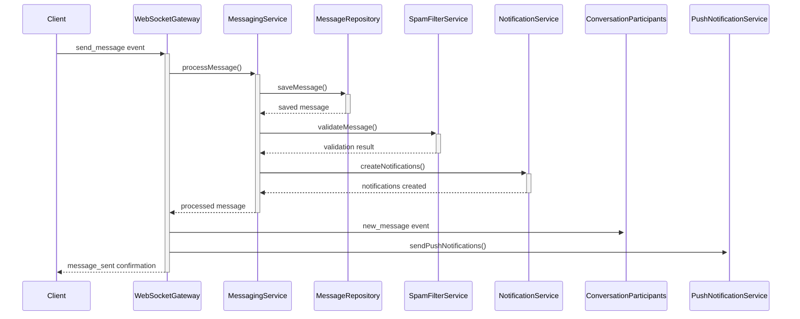
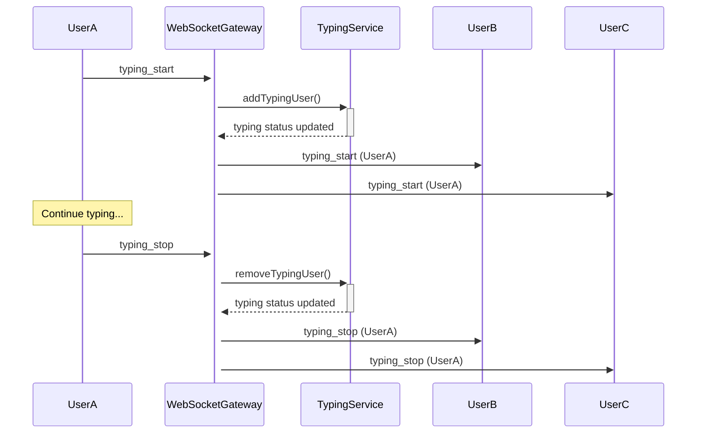
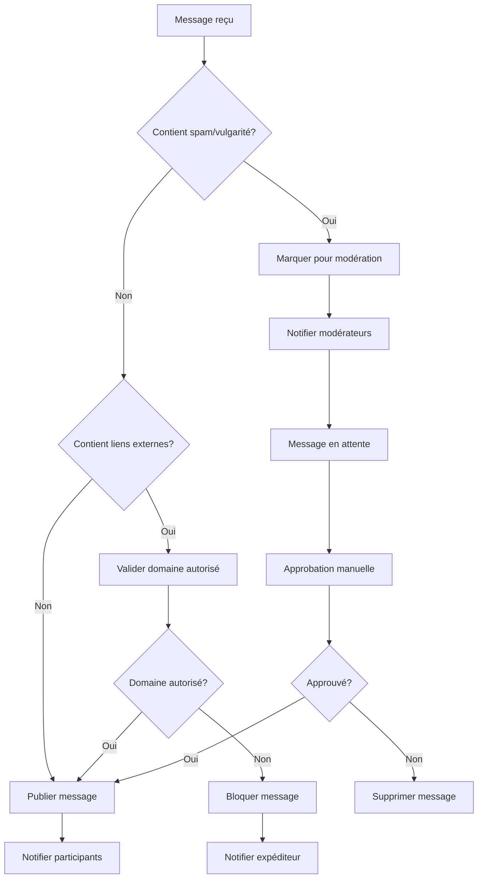

# Module Messaging - Documentation Technique

## 💬 Vue d'Ensemble

Le module `Messaging` fournit un système de messagerie temps réel complet pour la plateforme O'Ypunu. Il permet les conversations privées entre utilisateurs, la messagerie de groupe, et l'intégration avec les communautés linguistiques.

## 📁 Structure du Module

```
src/messaging/
├── controllers/
│   ├── messaging.controller.ts          # API REST messaging
│   ├── conversations.controller.ts      # Gestion conversations
│   └── notifications.controller.ts      # Notifications messages
├── gateways/
│   ├── messaging.gateway.ts             # WebSocket Gateway principal
│   ├── typing.gateway.ts                # Indicateurs de frappe
│   └── presence.gateway.ts              # Statut en ligne
├── dto/
│   ├── create-conversation.dto.ts       # DTO création conversation
│   ├── send-message.dto.ts              # DTO envoi message
│   ├── update-message.dto.ts            # DTO modification message
│   └── conversation-settings.dto.ts     # DTO paramètres conversation
├── schemas/
│   ├── conversation.schema.ts           # Schéma conversation
│   ├── message.schema.ts                # Schéma message
│   ├── message-attachment.schema.ts     # Pièces jointes
│   └── message-reaction.schema.ts       # Réactions messages
├── services/
│   ├── messaging.service.ts             # Service principal
│   ├── conversations.service.ts         # Gestion conversations
│   ├── notifications.service.ts         # Notifications temps réel
│   ├── file-upload.service.ts           # Upload pièces jointes
│   └── message-search.service.ts        # Recherche dans messages
├── interceptors/
│   ├── message-encryption.interceptor.ts # Chiffrement messages
│   └── spam-filter.interceptor.ts       # Filtre anti-spam
├── guards/
│   ├── conversation-member.guard.ts     # Vérification membre conversation
│   └── message-owner.guard.ts           # Vérification propriétaire message
└── messaging.module.ts                  # Configuration module
```

## 🎯 Responsabilités Principales

### 1. **Messagerie Temps Réel**
- **WebSocket Integration**: Socket.IO pour communication instantanée
- **Indicateurs Visuels**: Statut de frappe, lecture, livraison
- **Synchronisation Multi-Device**: Messages synchronisés sur tous appareils
- **Gestion Déconnexion**: Reconnexion automatique et récupération messages

### 2. **Types de Conversations**
- **Messages Privés**: Communication 1-to-1 entre utilisateurs
- **Conversations de Groupe**: Discussions multi-participants
- **Canaux Communautaires**: Messages liés aux communautés
- **Messages Système**: Notifications automatiques et alertes

### 3. **Fonctionnalités Avancées**
- **Pièces Jointes**: Images, audio, documents, mots du dictionnaire
- **Réactions**: Emojis et réactions rapides aux messages
- **Recherche**: Recherche full-text dans l'historique des messages
- **Modération**: Filtres anti-spam et modération automatique

### 4. **Sécurité et Confidentialité**
- **Chiffrement**: Messages chiffrés end-to-end (optionnel)
- **Permissions**: Contrôle granulaire des accès
- **Audit Trail**: Logging des actions sensibles
- **Suppression**: Suppression définitive ou archivage

## 🔧 Schémas de Données

### Conversation Schema
```typescript
interface Conversation {
  _id: ObjectId;
  type: 'private' | 'group' | 'community' | 'system';
  
  // Participants
  participants: {
    userId: ObjectId;
    role: 'member' | 'admin' | 'owner';
    joinedAt: Date;
    lastReadAt: Date;                    // Dernière lecture
    notificationLevel: 'all' | 'mentions' | 'none';
    status: 'active' | 'left' | 'removed';
  }[];
  
  // Métadonnées conversation
  title?: string;                        // Nom du groupe (si applicable)
  description?: string;                  // Description groupe
  avatar?: string;                       // Image groupe
  
  // Configuration
  settings: {
    isEncrypted: boolean;                // Chiffrement end-to-end
    allowFileSharing: boolean;           // Partage fichiers autorisé
    maxParticipants: number;             // Limite participants (groupes)
    autoDeleteAfter?: number;            // Auto-suppression (jours)
    requireApprovalToJoin: boolean;      // Approbation pour rejoindre
  };
  
  // Référence communauté (si applicable)
  communityId?: ObjectId;
  communityChannelId?: string;
  
  // Statistiques
  stats: {
    messageCount: number;
    activeParticipants: number;
    lastActivity: Date;
    averageResponseTime: number;         // Temps réponse moyen
  };
  
  // Métadonnées système
  createdBy: ObjectId;
  createdAt: Date;
  updatedAt: Date;
  archivedAt?: Date;
  
  // Derniers messages (dénormalisé pour performance)
  lastMessage?: {
    id: ObjectId;
    content: string;
    senderId: ObjectId;
    timestamp: Date;
    type: 'text' | 'image' | 'file' | 'system';
  };
}
```

### Message Schema
```typescript
interface Message {
  _id: ObjectId;
  conversationId: ObjectId;             // Conversation parente
  senderId: ObjectId;                   // Expéditeur
  
  // Contenu message
  content: string;                      // Texte principal
  contentType: 'text' | 'rich' | 'markdown' | 'system';
  messageType: 'text' | 'image' | 'file' | 'audio' | 'word' | 'system';
  
  // Message réponse/thread
  replyToMessageId?: ObjectId;          // Réponse à un message
  threadId?: ObjectId;                  // ID du thread
  
  // Pièces jointes
  attachments: {
    type: 'image' | 'file' | 'audio' | 'word';
    url: string;
    filename: string;
    size: number;
    mimeType: string;
    metadata?: {
      width?: number;                   // Images
      height?: number;
      duration?: number;                // Audio
      wordId?: ObjectId;                // Mots du dictionnaire
    };
  }[];
  
  // Mentions et interactions
  mentions: ObjectId[];                 // Utilisateurs mentionnés
  reactions: {
    emoji: string;
    userId: ObjectId;
    addedAt: Date;
  }[];
  
  // Statut et livraison
  status: 'sending' | 'sent' | 'delivered' | 'read' | 'failed';
  deliveryStatus: {
    [userId: string]: {
      status: 'delivered' | 'read';
      timestamp: Date;
    };
  };
  
  // Modération
  isModerated: boolean;
  moderationReason?: string;
  moderatedBy?: ObjectId;
  reportCount: number;
  
  // Édition et suppression
  isEdited: boolean;
  editedAt?: Date;
  isDeleted: boolean;
  deletedAt?: Date;
  deletedBy?: ObjectId;
  
  // Chiffrement
  isEncrypted: boolean;
  encryptionKey?: string;               // Clé chiffrement (si applicable)
  
  // Métadonnées
  createdAt: Date;
  updatedAt: Date;
  
  // Métadonnées système (messages automatiques)
  systemMetadata?: {
    action: 'user_joined' | 'user_left' | 'title_changed' | 'settings_updated';
    actionBy: ObjectId;
    actionData: any;
  };
}
```

### MessageNotification Schema
```typescript
interface MessageNotification {
  _id: ObjectId;
  userId: ObjectId;                     // Destinataire notification
  conversationId: ObjectId;             // Conversation concernée
  messageId: ObjectId;                  // Message déclencheur
  
  // Type et contenu
  type: 'new_message' | 'mention' | 'reply' | 'reaction';
  title: string;                        // Titre notification
  body: string;                         // Corps notification
  
  // Statut
  isRead: boolean;                      // Lu par l'utilisateur
  readAt?: Date;
  isDelivered: boolean;                 // Livré (push/email)
  deliveredAt?: Date;
  
  // Canal de livraison
  channels: {
    push: boolean;                      // Notification push
    email: boolean;                     // Email
    inApp: boolean;                     // In-app notification
  };
  
  // Métadonnées
  createdAt: Date;
  expiresAt: Date;                      // Expiration notification
}
```

## 📊 Endpoints API

### Conversations Management

| Endpoint | Method | Description | Guards | Rate Limit |
|----------|--------|-------------|---------|------------|
| `/conversations` | GET | Liste conversations utilisateur | JWT | 100/min |
| `/conversations` | POST | Créer nouvelle conversation | JWT | 20/hour |
| `/conversations/:id` | GET | Détails conversation + messages | JWT + Member | 200/min |
| `/conversations/:id` | PUT | Modifier conversation | JWT + Admin | 10/hour |
| `/conversations/:id` | DELETE | Supprimer/Archiver conversation | JWT + Owner | 5/hour |
| `/conversations/:id/join` | POST | Rejoindre conversation | JWT | 10/hour |
| `/conversations/:id/leave` | POST | Quitter conversation | JWT | 5/hour |

### Messages Management

| Endpoint | Method | Description | Guards | Rate Limit |
|----------|--------|-------------|---------|------------|
| `/conversations/:id/messages` | GET | Messages conversation (paginé) | JWT + Member | 500/min |
| `/conversations/:id/messages` | POST | Envoyer nouveau message | JWT + Member | 100/hour |
| `/conversations/:id/messages/:msgId` | PUT | Modifier message | JWT + Owner | 50/hour |
| `/conversations/:id/messages/:msgId` | DELETE | Supprimer message | JWT + Owner | 20/hour |
| `/conversations/:id/messages/:msgId/react` | POST | Ajouter réaction | JWT + Member | 200/hour |
| `/conversations/:id/messages/search` | GET | Recherche dans messages | JWT + Member | 50/min |

### File Upload & Attachments

| Endpoint | Method | Description | Guards | File Size |
|----------|--------|-------------|---------|-----------| 
| `/conversations/:id/upload` | POST | Upload pièce jointe | JWT + Member | 10MB max |
| `/conversations/:id/messages/:msgId/attachments` | GET | Liste pièces jointes | JWT + Member | - |
| `/attachments/:id/download` | GET | Télécharger fichier | JWT + Access | - |

### Real-time WebSocket Events

| Event | Direction | Description | Data |
|-------|-----------|-------------|------|
| `join_conversation` | Client → Server | Rejoindre conversation | `{ conversationId }` |
| `leave_conversation` | Client → Server | Quitter conversation | `{ conversationId }` |
| `send_message` | Client → Server | Envoyer message | `SendMessageDto` |
| `new_message` | Server → Client | Nouveau message reçu | `Message` |
| `message_updated` | Server → Client | Message modifié | `Message` |
| `message_deleted` | Server → Client | Message supprimé | `{ messageId }` |
| `typing_start` | Client ↔ Server | Commence à écrire | `{ conversationId }` |
| `typing_stop` | Client ↔ Server | Arrête d'écrire | `{ conversationId }` |
| `user_online` | Server → Client | Utilisateur en ligne | `{ userId }` |
| `user_offline` | Server → Client | Utilisateur hors ligne | `{ userId }` |

## 🔄 Flows Principaux

### 1. Envoi de Message Temps Réel


### 2. Gestion des Indicateurs de Frappe


### 3. Workflow de Modération Automatique


## 🛡️ Sécurité et Modération

### Anti-Spam et Validation
```typescript
@Injectable()
export class SpamFilterService {
  async validateMessage(message: SendMessageDto, userId: string): Promise<ValidationResult> {
    const checks = await Promise.all([
      this.checkRateLimit(userId),                    // Limite taux d'envoi
      this.checkContentSpam(message.content),         // Détection spam
      this.checkLinksAllowed(message.content),        // Validation liens
      this.checkAttachmentSafety(message.attachments), // Sécurité fichiers
      this.checkUserReputation(userId)                // Réputation expéditeur
    ]);
    
    return {
      isValid: checks.every(check => check.passed),
      violations: checks.filter(check => !check.passed),
      confidence: this.calculateConfidenceScore(checks)
    };
  }
  
  private async checkContentSpam(content: string): Promise<ValidationCheck> {
    // Détection patterns spam, liens suspects, texte répétitif
    const spamScore = await this.calculateSpamScore(content);
    return {
      passed: spamScore < 0.7,
      reason: spamScore >= 0.7 ? 'Content detected as spam' : null,
      confidence: 1 - spamScore
    };
  }
}
```

### Chiffrement End-to-End (Optionnel)
```typescript
@Injectable()
export class MessageEncryptionService {
  async encryptMessage(
    content: string, 
    conversationId: string, 
    participants: string[]
  ): Promise<EncryptedMessage> {
    if (!this.isEncryptionEnabled(conversationId)) {
      return { content, isEncrypted: false };
    }
    
    const conversationKey = await this.getOrCreateConversationKey(conversationId);
    const encryptedContent = await this.encrypt(content, conversationKey);
    
    return {
      content: encryptedContent,
      isEncrypted: true,
      keyVersion: conversationKey.version
    };
  }
  
  async decryptMessage(
    encryptedContent: string, 
    conversationId: string, 
    keyVersion: number
  ): Promise<string> {
    const conversationKey = await this.getConversationKey(conversationId, keyVersion);
    return await this.decrypt(encryptedContent, conversationKey);
  }
}
```

## 📈 Analytics et Performance

### Métriques Messaging
```typescript
interface MessagingAnalytics {
  // Volume et activité
  totalMessages: number;
  messagesPerDay: number;
  averageMessagesPerUser: number;
  peakHours: HourlyStats[];
  
  // Types de conversations
  conversationTypeDistribution: {
    private: number;
    group: number;
    community: number;
  };
  
  // Engagement temps réel
  activeConversations: number;
  averageResponseTime: number;
  messageReadRate: number;
  typingIndicatorUsage: number;
  
  // Contenu et médias
  textMessagePercentage: number;
  mediaMessagePercentage: number;
  mostUsedReactions: ReactionStats[];
  averageMessageLength: number;
  
  // Modération
  spamDetectionRate: number;
  moderatedMessagesCount: number;
  falsePositiveRate: number;
  
  // Performance technique
  averageLatency: number;
  messageDeliveryRate: number;
  connectionStability: number;
  errorRate: number;
}
```

### Optimisations Performance
```typescript
@Injectable()
export class MessagingPerformanceService {
  // Cache des conversations actives en mémoire
  private activeConversations = new Map<string, ConversationCache>();
  
  // Pool de connexions WebSocket optimisé
  private connectionPool = new WebSocketConnectionPool({
    maxConnections: 10000,
    heartbeatInterval: 30000,
    reconnectAttempts: 3
  });
  
  async optimizeMessageDelivery(): Promise<void> {
    // Stratégies d'optimisation :
    // 1. Clustering par géolocalisation
    // 2. Load balancing des WebSocket
    // 3. Compression des messages
    // 4. Batch delivery pour notifications
    
    await Promise.all([
      this.optimizeGeographicClustering(),
      this.balanceWebSocketLoad(),
      this.enableMessageCompression(),
      this.configureBatchNotifications()
    ]);
  }
}
```

## 🔧 Intégrations et Extensions

### Intégration Communautés
```typescript
@Injectable()
export class CommunityMessagingIntegration {
  async createCommunityChannel(
    communityId: string, 
    channelName: string
  ): Promise<Conversation> {
    // Création automatique canal pour nouvelle communauté
    const conversation = await this.conversationsService.create({
      type: 'community',
      title: `#${channelName}`,
      communityId,
      settings: {
        isEncrypted: false,
        allowFileSharing: true,
        maxParticipants: 1000,
        requireApprovalToJoin: false
      }
    });
    
    // Ajout automatique des membres de la communauté
    const communityMembers = await this.communityService.getMembers(communityId);
    await this.addParticipantsToConversation(conversation.id, communityMembers);
    
    return conversation;
  }
}
```

### Bot Integration et Messages Automatiques
```typescript
@Injectable()
export class MessagingBotService {
  async sendWelcomeMessage(userId: string, conversationId: string): Promise<void> {
    const welcomeMessage = await this.generateWelcomeMessage(userId);
    
    await this.messagingService.sendSystemMessage({
      conversationId,
      content: welcomeMessage,
      messageType: 'system',
      systemMetadata: {
        action: 'user_joined',
        actionBy: userId,
        actionData: { welcomeMessage: true }
      }
    });
  }
  
  async sendDailyLanguageTip(userId: string): Promise<void> {
    const userLanguages = await this.userService.getLearningLanguages(userId);
    const tip = await this.languageTipService.getDailyTip(userLanguages[0]);
    
    await this.messagingService.sendDirectMessage({
      senderId: 'system-bot',
      recipientId: userId,
      content: `💡 **Astuce du jour** : ${tip.content}`,
      messageType: 'text',
      attachments: tip.relatedWords ? [{
        type: 'word',
        wordId: tip.relatedWords[0],
        metadata: { isEducational: true }
      }] : []
    });
  }
}
```

## 🧪 Tests et Qualité

### Scénarios de Tests Critiques
```typescript
describe('MessagingService', () => {
  describe('Real-time Communication', () => {
    it('should deliver messages in real-time');
    it('should handle connection drops gracefully');
    it('should sync messages across multiple devices');
    it('should maintain message order');
  });
  
  describe('Security and Moderation', () => {
    it('should filter spam messages effectively');
    it('should encrypt sensitive conversations');
    it('should validate file uploads securely');
    it('should respect user privacy settings');
  });
  
  describe('Performance and Scalability', () => {
    it('should handle 1000+ concurrent connections');
    it('should deliver messages within 100ms');
    it('should compress large message histories');
    it('should cleanup old conversations automatically');
  });
  
  describe('Integration Features', () => {
    it('should integrate with community channels');
    it('should send automated notifications');
    it('should support word dictionary attachments');
    it('should handle multi-language content');
  });
});
```

### Performance Benchmarks
- **Message Delivery**: < 100ms (99th percentile)
- **Connection Establishment**: < 500ms
- **File Upload**: < 2s (5MB file)
- **Search in History**: < 300ms (10k messages)
- **Concurrent Connections**: 10,000+ stable

---

**Version**: 1.0.0  
**Dernière mise à jour**: 30 Juillet 2025  
**Responsable**: Équipe Real-time O'Ypunu