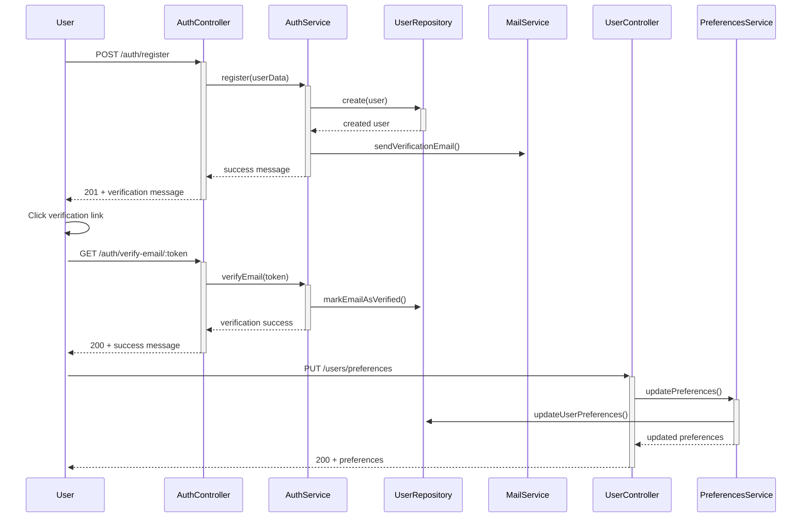
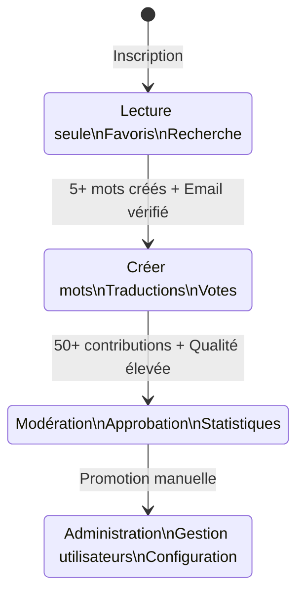
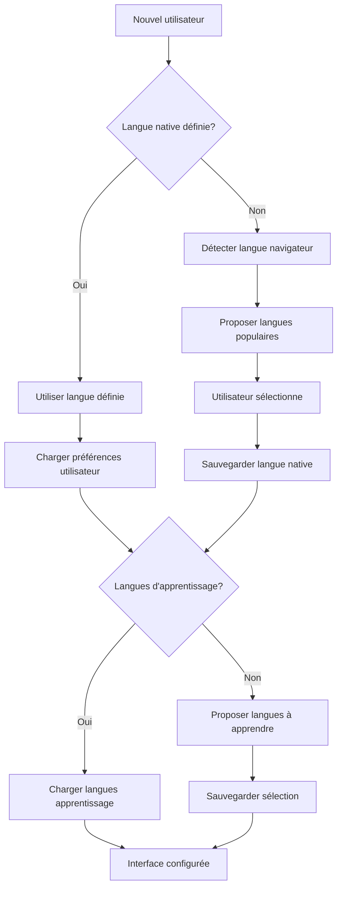

# Module Users - Documentation Technique

## 👥 Vue d'Ensemble

Le module `Users` gère l'ensemble du système utilisateur de la plateforme O'Ypunu. Il couvre la gestion des profils, préférences linguistiques, paramètres de compte, et l'interaction sociale entre utilisateurs.

## 📁 Structure du Module

```
src/users/
├── controllers/
│   ├── users.controller.ts              # CRUD utilisateurs
│   ├── profile.controller.ts            # Gestion profils
│   └── preferences.controller.ts        # Préférences utilisateur
├── dto/
│   ├── register.dto.ts                  # DTO inscription
│   ├── login.dto.ts                     # DTO connexion
│   ├── update-profile.dto.ts            # DTO mise à jour profil
│   └── user-preferences.dto.ts          # DTO préférences
├── schemas/
│   ├── user.schema.ts                   # Schéma principal utilisateur
│   ├── user-profile.schema.ts           # Profil utilisateur étendu
│   ├── user-preference.schema.ts        # Préférences système
│   └── word-view.schema.ts              # Historique vues mots
├── services/
│   ├── users.service.ts                 # Service principal
│   ├── profile.service.ts               # Gestion profils
│   └── preferences.service.ts           # Gestion préférences
└── users.module.ts                      # Configuration module
```

## 🎯 Responsabilités Principales

### 1. **Gestion des Comptes Utilisateur**
- **CRUD Complet**: Création, lecture, mise à jour, suppression de comptes
- **Profils Étendus**: Informations personnelles, bio, photo de profil
- **Préférences**: Langues natives, langues d'apprentissage, paramètres UI
- **Sécurité**: Gestion des mots de passe, tokens de vérification

### 2. **Système de Rôles et Permissions**
- **Hiérarchie des Rôles**: USER → CONTRIBUTOR → ADMIN → SUPERADMIN
- **Progression Automatique**: Promotion basée sur l'activité et qualité
- **Permissions Granulaires**: Contrôle d'accès par feature
- **Audit Trail**: Traçabilité des changements de rôles

### 3. **Profils Linguistiques**
- **Langues Natives**: Jusqu'à 3 langues maternelles
- **Langues d'Apprentissage**: Langues étudiées par l'utilisateur
- **Niveaux de Compétence**: Débutant, Intermédiaire, Avancé, Natif
- **Historique d'Apprentissage**: Progression dans le temps

### 4. **Social et Interaction**
- **Connexions**: Système d'amis/suiveurs (optionnel)
- **Contributions Publiques**: Mots créés, traductions ajoutées
- **Réputation**: Score basé sur la qualité des contributions
- **Badges et Récompenses**: Système de gamification

## 🔧 Schémas de Données

### User Schema Principal
```typescript
interface User {
  _id: ObjectId;
  email: string;                         // Email unique et vérifié
  username: string;                      // Nom d'utilisateur unique
  password: string;                      // Hash bcrypt
  
  // Informations personnelles
  firstName?: string;
  lastName?: string;
  fullName?: string;                     // Nom complet affiché
  bio?: string;                          // Biographie courte
  profilePicture?: string;               // URL image profil
  
  // Statut du compte
  isEmailVerified: boolean;              // Email confirmé
  isActive: boolean;                     // Compte actif
  role: UserRole;                        // Rôle système
  
  // Langues et apprentissage
  nativeLanguageId?: ObjectId;           // Langue maternelle principale
  nativeLanguageIds: ObjectId[];         // Toutes les langues natives
  learningLanguageIds: ObjectId[];       // Langues en apprentissage
  
  // Préférences système
  preferences: {
    theme: 'light' | 'dark' | 'auto';
    language: string;                    // Langue interface
    notifications: {
      email: boolean;
      push: boolean;
      wordApproved: boolean;
      translationAdded: boolean;
    };
    privacy: {
      profileVisible: boolean;
      showContributions: boolean;
      showProgress: boolean;
    };
  };
  
  // Authentification sociale
  socialProviders?: {
    google?: { id: string; email: string };
    facebook?: { id: string; email: string };
    twitter?: { id: string; username: string };
  };
  
  // Tokens de sécurité
  emailVerificationToken?: string;
  emailVerificationTokenExpires?: Date;
  passwordResetToken?: string;
  passwordResetTokenExpires?: Date;
  
  // Métadonnées d'activité
  lastLogin?: Date;
  lastActive?: Date;
  loginCount: number;
  
  // Statistiques
  stats: {
    wordsCreated: number;
    translationsAdded: number;
    wordsViewed: number;
    favoriteWords: number;
    contributionScore: number;           // Score qualité global
  };
  
  // Timestamps
  createdAt: Date;
  updatedAt: Date;
}
```

### UserRole Enum
```typescript
enum UserRole {
  USER = 'user',                         // Utilisateur standard
  CONTRIBUTOR = 'contributor',           // Peut créer des mots
  ADMIN = 'admin',                       // Administration générale
  SUPERADMIN = 'superadmin'             // Administration complète
}
```

### UserPreferences Schema
```typescript
interface UserPreferences {
  _id: ObjectId;
  userId: ObjectId;                      // Référence utilisateur
  
  // Préférences d'apprentissage
  learning: {
    dailyGoal: number;                   // Mots par jour
    reminderTime: string;                // Heure notification
    difficultyLevel: 'beginner' | 'intermediate' | 'advanced';
    focusLanguages: ObjectId[];          // Langues prioritaires
  };
  
  // Interface utilisateur
  ui: {
    theme: 'light' | 'dark' | 'auto';
    fontSize: 'small' | 'medium' | 'large';
    animationsEnabled: boolean;
    compactMode: boolean;
  };
  
  // Notifications
  notifications: {
    email: {
      enabled: boolean;
      wordApproved: boolean;
      translationAdded: boolean;
      dailyReminder: boolean;
      weeklyProgress: boolean;
    };
    push: {
      enabled: boolean;
      wordOfTheDay: boolean;
      streakReminder: boolean;
      socialUpdates: boolean;
    };
  };
  
  // Confidentialité
  privacy: {
    profileVisibility: 'public' | 'friends' | 'private';
    showRealName: boolean;
    showContributions: boolean;
    showLearningProgress: boolean;
    allowDirectMessages: boolean;
  };
  
  createdAt: Date;
  updatedAt: Date;
}
```

## 📊 Endpoints API

### User Management

| Endpoint | Method | Description | Guards | Rate Limit |
|----------|--------|-------------|---------|------------|
| `/users/profile` | GET | Profil utilisateur connecté | JWT | 100/min |
| `/users/profile` | PUT | Modifier profil | JWT | 10/hour |
| `/users/profile/avatar` | POST | Upload photo profil | JWT | 5/hour |
| `/users/:id` | GET | Profil public utilisateur | Optional JWT | 200/min |
| `/users/:id/stats` | GET | Statistiques utilisateur | Optional JWT | 50/min |

### Preferences Management

| Endpoint | Method | Description | Guards | Rate Limit |
|----------|--------|-------------|---------|------------|
| `/users/preferences` | GET | Préférences utilisateur | JWT | 50/min |
| `/users/preferences` | PUT | Modifier préférences | JWT | 20/hour |
| `/users/preferences/languages` | POST | Ajouter langue apprentissage | JWT | 10/hour |
| `/users/preferences/languages/:id` | DELETE | Retirer langue | JWT | 10/hour |

### Social Features

| Endpoint | Method | Description | Guards | Rate Limit |
|----------|--------|-------------|---------|------------|
| `/users/:id/contributions` | GET | Contributions utilisateur | Optional JWT | 100/min |
| `/users/:id/favorites` | GET | Mots favoris | JWT + Owner | 50/min |
| `/users/leaderboard` | GET | Classement contributeurs | None | 10/min |
| `/users/search` | GET | Recherche utilisateurs | JWT | 30/min |

## 🔄 Flows Principaux

### 1. Inscription et Configuration Initiale


### 2. Progression de Rôle Automatique


### 3. Gestion des Préférences Linguistiques


## 🛡️ Sécurité et Validation

### Validation des Données
```typescript
// RegisterDto validation
export class RegisterDto {
  @IsEmail()
  @Transform(({ value }) => value.toLowerCase())
  email: string;

  @IsString()
  @Length(3, 30)
  @Matches(/^[a-zA-Z0-9_-]+$/)
  username: string;

  @IsString()
  @MinLength(8)
  @Matches(/^(?=.*[a-z])(?=.*[A-Z])(?=.*\d)/)
  password: string;

  @IsOptional()
  @IsString()
  @Length(1, 50)
  firstName?: string;

  @IsOptional()
  @IsString()
  @Length(1, 50)
  lastName?: string;
}
```

### Protection des Données Sensibles
```typescript
// Exclusion automatique des champs sensibles
@Exclude()
password: string;

@Exclude()
emailVerificationToken?: string;

@Exclude()
passwordResetToken?: string;

// Transformation pour l'affichage public
@Transform(({ value }) => value ? 'verified' : 'pending')
@Expose({ groups: ['public'] })
emailStatus: string;
```

## 📈 Analytics et Métriques

### Métriques Utilisateur Collectées
```typescript
interface UserAnalytics {
  // Engagement
  dailyActiveUsers: number;
  weeklyActiveUsers: number;
  monthlyActiveUsers: number;
  averageSessionDuration: number;
  
  // Progression
  newRegistrations: number;
  emailVerificationRate: number;
  roleProgressionStats: {
    userToContributor: number;
    contributorToAdmin: number;
  };
  
  // Activité
  wordsCreatedPerUser: number;
  translationsPerUser: number;
  searchesPerUser: number;
  favoriteWordsPerUser: number;
  
  // Rétention
  dayOneRetention: number;
  daySevenRetention: number;
  dayThirtyRetention: number;
  
  // Langues
  popularNativeLanguages: LanguageStats[];
  popularLearningLanguages: LanguageStats[];
  languagePairStats: LanguagePairStats[];
}
```

### Service Analytics
```typescript
@Injectable()
export class UserAnalyticsService {
  async generateUserReport(period: string): Promise<UserAnalytics> {
    // Métriques d'engagement
    const engagement = await this.calculateEngagementMetrics(period);
    
    // Métriques de progression
    const progression = await this.calculateProgressionMetrics(period);
    
    // Métriques d'activité
    const activity = await this.calculateActivityMetrics(period);
    
    return {
      ...engagement,
      ...progression,
      ...activity
    };
  }
  
  async trackUserActivity(userId: string, activity: UserActivity): Promise<void> {
    await this.userActivityRepository.create({
      userId,
      activityType: activity.type,
      metadata: activity.metadata,
      timestamp: new Date()
    });
  }
}
```

## 🧪 Tests et Qualité

### Scénarios de Tests Critiques
```typescript
describe('UsersService', () => {
  describe('Profile Management', () => {
    it('should update user profile with valid data');
    it('should reject invalid email formats');
    it('should handle profile picture upload');
    it('should maintain username uniqueness');
  });
  
  describe('Language Preferences', () => {
    it('should add learning language');
    it('should prevent duplicate learning languages');
    it('should validate language existence');
    it('should limit number of learning languages');
  });
  
  describe('Role Progression', () => {
    it('should auto-promote user to contributor');
    it('should maintain role hierarchy');
    it('should log role changes');
    it('should update permissions on role change');
  });
  
  describe('Privacy and Security', () => {
    it('should exclude sensitive fields from public profile');
    it('should validate preference updates');
    it('should handle account deactivation');
    it('should respect privacy settings');
  });
});
```

### Performance Benchmarks
- **Profile Load Time**: < 100ms
- **Preferences Update**: < 200ms
- **Search Users**: < 300ms (jusqu'à 10k utilisateurs)
- **Analytics Generation**: < 2s

---

**Version**: 1.0.0  
**Dernière mise à jour**: 30 Juillet 2025  
**Responsable**: Équipe Backend O'Ypunu